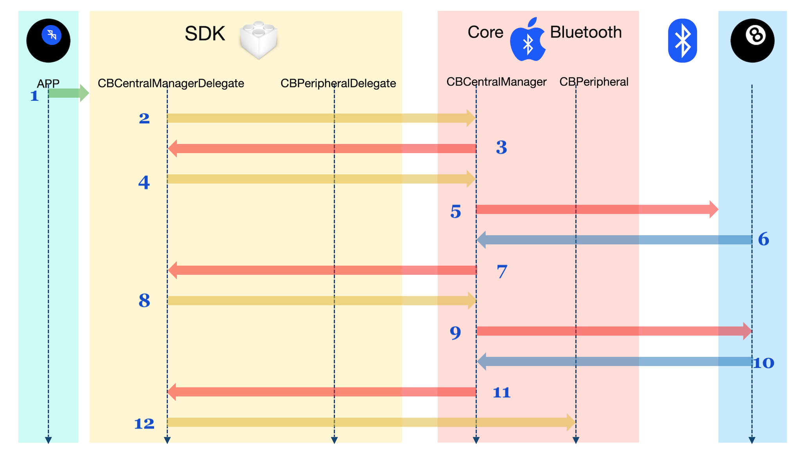
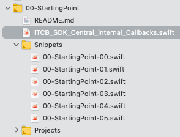

## CREATING A CENTRAL MANAGER/DELEGATE (`00-StartingPoint`)

At this point, none of the applications will operate correctly as Bluetooth Centrals ("Question Askers"), but the MacOS and iOS/iPadOS variants already operate correctly as Bluetooth Peripherals ("Magic 8-Ball Answerers").

In this exercise, we'll add the Central functionality to all the apps. We'll do this by working on the SDK, which is common to all the apps.

The SDK has two different main classes: [the `ITCB_SDK_Central` class](https://github.com/ChrisMarshallNY/ITCB-master/blob/master/00-StartingPoint/SDK-src/src/public/ITCB_SDK.swift#L130), and [the `ITCB_SDK_Peripheral` class](https://github.com/ChrisMarshallNY/ITCB-master/blob/master/00-StartingPoint/SDK-src/src/public/ITCB_SDK.swift#L169) (only available for MacOS and iOS/iPadOS).

In this class, we will be working exclusively on [the `ITCB_SDK_Central` class](https://github.com/ChrisMarshallNY/ITCB-master/blob/master/00-StartingPoint/SDK-src/src/public/ITCB_SDK.swift#L130); starting from an "empty," non-functional implementation, and arrive at a full implementation.

The lesson will be in two "phases." This is the first "phase," where we will implement the basic Central functionality that discovers and connects to Peripherals. In the second phase, we will be working on what happens after the connection is established.

In the first part of this phase, we'll create the [`CBCentralManager`](https://developer.apple.com/documentation/corebluetooth/cbcentralmanager) instance.

In the second part, we'll add the basic [`CBCentralManagerDelegate`](https://developer.apple.com/documentation/corebluetooth/cbcentralmanagerdelegate) callbacks, and establish our Core Bluetooth presence.

By the end of this phase, the apps will still not operate completely, but we'll be able to observe Core Bluetooth operating "under the hood," through `print()` statements.

We will see that the app initializes the Core Bluetooth subsystem, creates a Central Manager instance, then uses that instance to discover advertising devices, and initiate connections to them.

## FIRST, LET'S SEE WHAT WE HAVE

If you haven't already done so, open the [`ITCB.xcworkspace`](https://github.com/ChrisMarshallNY/ITCB-master/tree/master/00-StartingPoint/ITCB.xcworkspace) workspace with Xcode, and use the Project navigator to select the [`00-StartingPoint/ITCB_SDK_Central_internal_Callbacks.swift`](https://github.com/ChrisMarshallNY/ITCB-master/blob/master/00-StartingPoint/SDK-src/src/internal/ITCB_SDK_Central_internal_Callbacks.swift) file (which is actually an "alias" to the `00-StartingPoint/SDK-src/src/internal/ITCB_SDK_Central_internal_Callbacks.swift` file).

The following code is all that you'll see (***NOTE:*** *We are removing comments, in order to keep these examples smaller*):
```
    import CoreBluetooth

    internal let _static_ITCB_SDK_8BallServiceUUID = CBUUID(string: "8E38140A-27BE-4090-8955-4FC4B5698D1E")
    internal let _static_ITCB_SDK_8BallService_Question_UUID = CBUUID(string: "BDD37D7A-F66A-47B9-A49C-FE29FD235A77")
    internal let _static_ITCB_SDK_8BallService_Answer_UUID = CBUUID(string: "349A0D7B-6215-4E2C-A095-AF078D737445")
```

This is the bare minimum to allow the SDK to compile and operate in Peripheral Mode for the apps. These declarations are necessary for the app to compile in Peripheral Mode (which is only used for the MacOS and iOS/iPadOS variants, so this code is ignored for WatchOS and TVOS).

Those three [`CBUUID`](https://developer.apple.com/documentation/corebluetooth/cbuuid)s are the unique identifiers that we are using to denote the special Service and the two Characteristics that we use for our "magic 8-ball" game. They were generated using the following technique:

### Command Line

Simply start Terminal, and enter "[`uuidgen`](https://www.freebsd.org/cgi/man.cgi?query=uuidgen&sektion=1&manpath=freebsd-release-ports)", followed by a carriage return.
```
    [Command Prompt]>$ uuidgen⏎
```
Which will print out a line of Hex characters, like so:
```
    8E38140A-27BE-4090-8955-4FC4B5698D1E
```
[`uuidgen`](https://www.freebsd.org/cgi/man.cgi?query=uuidgen&sektion=1&manpath=freebsd-release-ports) is a built-in UUID generator, and we can use it to create unique identifiers for our attributes. The devices, themselves, will already have their own UUIDs.

### UUID-Generator Web Site

You can also use a UUID-generator Web site, [like this one](https://www.uuidgenerator.net/).

## A TIMELINE OF EVENTS
This diagram will illustrate the various steps and states in the lesson:



1. The app creates an instance of [`ITCB_SDK_Central`](https://github.com/ChrisMarshallNY/ITCB-master/blob/master/00-StartingPoint/SDK-src/src/public/ITCB_SDK.swift#L130), which is the Central version of the SDK.
2. This SDK instance creates an instance of [`CBCentralManager`](https://developer.apple.com/documentation/corebluetooth/cbcentralmanager).
3. This instance of [`CBCentralManager`](https://developer.apple.com/documentation/corebluetooth/cbcentralmanager) calls the delegate method [`CBCentralManagerDelegate.centralManagerDidUpdateState(_:)`](https://developer.apple.com/documentation/corebluetooth/cbcentralmanagerdelegate/1518888-centralmanagerdidupdatestate) in the SDK, telling it that it is ready to scan.
4. The SDK then calls [`CBCentralManager.scanForPeripherals(withServices:,options:)`](https://developer.apple.com/documentation/corebluetooth/cbcentralmanager/1518986-scanforperipherals). This tells Core Bluetooth to start scanning for Peripherals.
5. Core Bluetooth starts scanning for advertising peripherals.
6. A matching Peripheral is discovered by Core Bluetooth.
7. The instance of [`CBCentralManager`](https://developer.apple.com/documentation/corebluetooth/cbcentralmanager) calls the delegate method [`CBCentralManagerDelegate.centralManager(_:,didDiscover:,advertisementData:,rssi:)`](https://developer.apple.com/documentation/corebluetooth/cbcentralmanagerdelegate/1518937-centralmanager) in the SDK, with an instance of [`CBPeripheral`](https://developer.apple.com/documentation/corebluetooth/cbperipheral). This represents the discovered Peripheral.
8. The SDK creates a strong reference to the Peripheral, then calls [`CBCentralManager.connect(_:,options:)`](https://developer.apple.com/documentation/corebluetooth/cbcentralmanager/1518766-connect), asking it to connect to the discovered Peripheral.
9. Core Bluetooth sends a connection request to the Peripheral.
10. The Peripheral accepts the connection request. Core Bluetooth now has a connection to the Peripheral.
11. The instance of [`CBCentralManager`](https://developer.apple.com/documentation/corebluetooth/cbcentralmanager) calls the delegate method [`CBCentralManagerDelegate.centralManager(_:,didConnect:)`](https://developer.apple.com/documentation/corebluetooth/cbcentralmanagerdelegate/1518969-centralmanager) in the SDK, informing the SDK that it has successfully connected to the Peripheral.
12. Now that we are connected to the Peripheral, the SDK then calls [`CBPeripheral.discoverServices(_:)`](https://developer.apple.com/documentation/corebluetooth/cbperipheral/1518706-discoverservices) on that Peripheral (note that it is asking [`CBPeripheral`](https://developer.apple.com/documentation/corebluetooth/cbperipheral) to do the discovery -not [`CBCentralManager`](https://developer.apple.com/documentation/corebluetooth/cbcentralmanager)); asking it to return a list of available Services.

## ON TO CODING

Now, we'll start to add code. While we do that, we'll examine what is happening, step-by-step.

What we will do, is start off with a non-functional [`ITCB_SDK_Central`](https://github.com/ChrisMarshallNY/ITCB-master/blob/master/00-StartingPoint/SDK-src/src/public/ITCB_SDK.swift#L130) class. This class is consumed by the main app. The app is already written, debugged and ready for release, so we won't be touching the app code.

Instead, we'll be building up the SDK, slowly making it functional; step-by-step. As we do this, the app will start to work (as a Central). Remember that the app already works as a Peripheral (for Mac and iOS), so we will be working in a very narrow domain.

### The Snippets

We will be copying (and pasting) pre-written snippets of code, supplied in [a GitHub Gist](https://gist.github.com/ChrisMarshallNY/d287be6dbcc88627178058bdee348d32), and also embedded in the main workspace (see image, below). The snippets will be pasted into [the `ITCB/src/Shared/internal/ITCB_SDK_Central_internal_Callbacks.swift` file](https://github.com/ChrisMarshallNY/ITCB-master/blob/master/00-StartingPoint/SDK-src/src/internal/ITCB_SDK_Central_internal_Callbacks.swift), which will integrate the new code into the ITCB SDK project, which will integrate into the "Magic 8-Ball" app.



### MAIN GOAL: Implementing the [`CBCentralManagerDelegate`](https://developer.apple.com/documentation/corebluetooth/cbcentralmanagerdelegate) Protocol

This means that we'll be doing a couple of things:

1. We'll create an _unconstrained_ extension of the [`ITCB_SDK_Central`](https://github.com/ChrisMarshallNY/ITCB-master/blob/master/00-StartingPoint/SDK-src/src/public/ITCB_SDK.swift#L130) class to hold the first step (overriding the stored property).

2. Inside that extension, we'll create [a computed override](https://gist.github.com/ChrisMarshallNY/d287be6dbcc88627178058bdee348d32#file-00-startingpoint-00-swift-L2) of a [stored property](https://github.com/ChrisMarshallNY/ITCB-master/blob/master/00-StartingPoint/SDK-src/src/public/ITCB_SDK.swift#L113) that stores an instance of [`CBCentralManager`](https://developer.apple.com/documentation/corebluetooth/cbcentralmanager), and assign it to [the superclass stored property](https://github.com/ChrisMarshallNY/ITCB-master/blob/master/00-StartingPoint/SDK-src/src/public/ITCB_SDK.swift#L113) (already prepared for it).

3. We'll create a _constrained_ extension of the [`ITCB_SDK_Central`](https://github.com/ChrisMarshallNY/ITCB-master/blob/master/00-StartingPoint/SDK-src/src/public/ITCB_SDK.swift#L130) class, adding several methods to provide conformance to the [`CBCentralManagerDelegate`](https://developer.apple.com/documentation/corebluetooth/cbcentralmanagerdelegate) protocol. The rest of the exercise will happen inside that extension.
    
#3 means that the [`ITCB_SDK_Central`](https://github.com/ChrisMarshallNY/ITCB-master/blob/master/00-StartingPoint/SDK-src/src/public/ITCB_SDK.swift#L130) class will be set up to "catch" messages from our instance of [`CBCentralManager`](https://developer.apple.com/documentation/corebluetooth/cbcentralmanager), and act on them.

### THIS WILL WORK ON ALL PLATFORMS

When we make a change to the SDK, it immediately becomes available to **ALL** platforms. If you run any of the schemes for the given phase, you will see the new functionality (and debug printouts) available in that platform.

So that means that you'll be able to see the changes by running any of these schemes:

- `00-StartingPoint-Bluetooth 8-Ball On Mac (App)` (For the class, this is the one that we will use)
- `00-StartingPoint-Bluetooth 8-Ball On iOS (App)` (Peripheral Mode will work, on this platform, as well as Central Mode. In our lesson, we will use Peripheral Mode on an iOS device)
- `00-StartingPoint-Bluetooth 8-Ball On Watch (App)` (Remember that Peripheral Mode will not work, on this platform)
- `00-StartingPoint-Bluetooth 8-Ball On TV (App)` (Remember that Peripheral Mode will not work, on this platform)

Remember that, even though the app will *run* in a simulator, it will not *work* in a simulator. It needs to run on a real device.

### STEP ONE: Instantiating the [`CBCentralManager`](https://developer.apple.com/documentation/corebluetooth/cbcentralmanager) Instance, and Assigning it to a Strong Reference

The first thing that we'll do, is add the following code, just below the static variables (This is in [the `00-StartingPoint-00.swift` snippet file](https://gist.github.com/ChrisMarshallNY/d287be6dbcc88627178058bdee348d32#file-00-startingpoint-00-swift)):

```
    extension ITCB_SDK_Central {
        override var _managerInstance: Any! {
            get {
                if super._managerInstance == nil {
                    print("Creating A new instance of CBCentralManager.")
                    super._managerInstance = CBCentralManager(delegate: self, queue: nil)
                }
            
                return super._managerInstance
            }
        
            set {
                super._managerInstance = newValue
            }
        }
    }
```
What this does, is override the stored property [`_managerInstance`](https://github.com/ChrisMarshallNY/ITCB-master/blob/master/00-StartingPoint/SDK-src/src/public/ITCB_SDK.swift#L113) with [a computed property](https://docs.swift.org/swift-book/LanguageGuide/Properties.html#ID259), so we intercept access to the stored property.

The [`_managerInstance`](https://github.com/ChrisMarshallNY/ITCB-master/blob/master/00-StartingPoint/SDK-src/src/public/ITCB_SDK.swift#L113) property is typeless, so that it can store either an instance of [`CBCentralManager`](https://developer.apple.com/documentation/corebluetooth/cbcentralmanager) or [`CBPeripheralManager`](https://developer.apple.com/documentation/corebluetooth/cbperipheralmanager), dependent upon the mode the SDK has been set to. It is *completely* typeless, as opposed to being an instance of [`CBManager`](https://developer.apple.com/documentation/corebluetooth/cbmanager), because I wanted to avoid referencing the Core Bluetooth module in the two "public" files (note that they both just import [`Foundation`](https://developer.apple.com/documentation/foundation)). I like my SDKs to hide as much stuff as possible.

It should also be noted that this is a **strong** reference. This is important. The `CB`*`XXX`*`Manager` instance needs to be kept around, after instantiation.

[Our getter method](https://gist.github.com/ChrisMarshallNY/d287be6dbcc88627178058bdee348d32#file-00-startingpoint-00-swift-L3) will check [the superclass instance of `_managerInstance`](https://github.com/ChrisMarshallNY/ITCB-master/blob/master/00-StartingPoint/SDK-src/src/public/ITCB_SDK.swift#L113) before returning it. If that instance is `nil`, then we'll actually instantiate an instance of [`CBCentralManager`](https://developer.apple.com/documentation/corebluetooth/cbcentralmanager), setting our class as the delegate, and using the Main Thread (by leaving the second argument as `nil`). We then assign this to the superclass property before returning the superclass property (which now has the new instance).

The setter is a simple straight-up passthrough.

> ***NOTE:*** *At this point, the build will be broken. The compiler will complain with a weird error like "Expression type 'CBCentralManager' is ambiguous without more context". This is because our main class is not [yet] conformant to [`CBCentralManagerDelegate`](https://developer.apple.com/documentation/corebluetooth/cbcentralmanagerdelegate). We'll fix that in just a minute.*

### STEP TWO: Adding [`CBCentralManagerDelegate`](https://developer.apple.com/documentation/corebluetooth/cbcentralmanagerdelegate) Conformance

Below the code we just added, we should now add this code (This is in [the `00-StartingPoint-01.swift` snippet file](https://gist.github.com/ChrisMarshallNY/d287be6dbcc88627178058bdee348d32#file-00-startingpoint-01-swift)):

```
    extension ITCB_SDK_Central: CBCentralManagerDelegate {
        public func centralManagerDidUpdateState(_ centralManager: CBCentralManager) { }
    }
```
Nothing will change, but the compiler will stop complaining.

That [`CBCentralManagerDelegate.centralManagerDidUpdateState(_:)`](https://developer.apple.com/documentation/corebluetooth/cbcentralmanagerdelegate/1518888-centralmanagerdidupdatestate) method is the only required method for [`CBCentralManagerDelegate`](https://developer.apple.com/documentation/corebluetooth/cbcentralmanagerdelegate) conformance. We added an empty "placeholder" method there (for now), in order to satisfy the conformance requirement.


#### Examining the State

It should be noted at this point that it's *really important* to not make any assumptions about the state of the Bluetooth subsystem, or any of the devices.

We should not proceed until Core Bluetooth reports that it is ready to go. It does this by setting the [`CBCentralManager.state`](https://developer.apple.com/documentation/corebluetooth/cbmanager/1648600-state) property to [`.poweredOn`](https://developer.apple.com/documentation/corebluetooth/cbmanagerstate/poweredon).

In our app, we'll assume that scanning is enabled at startup. What this means to us, is that when the Bluetooth subsystem is ready, we can immediately start scanning for peripherals.

We'll add the following code inside the empty [`CBCentralManagerDelegate.centralManagerDidUpdateState(_:)`](https://gist.github.com/ChrisMarshallNY/d287be6dbcc88627178058bdee348d32#file-00-startingpoint-01-swift-L2) method body (This is in [the `00-StartingPoint-02.swift` snippet file](https://gist.github.com/ChrisMarshallNY/d287be6dbcc88627178058bdee348d32#file-00-startingpoint-02-swift)):

```
        if centralManager.state == .poweredOn {
            print("Scanning for Peripherals")
            centralManager.scanForPeripherals(withServices: [_static_ITCB_SDK_8BallServiceUUID], options: nil)
        }
```
What we just did, was tell the app that, upon the Bluetooth system becoming powered-up and ready (the [`.poweredOn`](https://developer.apple.com/documentation/corebluetooth/cbmanagerstate/poweredon) state), we are to immediately [begin scanning for Peripherals](https://developer.apple.com/documentation/corebluetooth/cbcentralmanager/1518986-scanforperipherals).

Note the [`_static_ITCB_SDK_8BallServiceUUID`](https://github.com/ChrisMarshallNY/ITCB-master/blob/master/00-StartingPoint/SDK-src/src/internal/ITCB_SDK_Central_internal_Callbacks.swift#L28) that we send into the [`CBCentralManager.scanForPeripherals(withServices:,options:)`](https://gist.github.com/ChrisMarshallNY/d287be6dbcc88627178058bdee348d32#file-00-startingpoint-02-swift-L3) method. That tells the Central to filter advertisements from Peripherals, and only pay attention to ones that claim that they provide the "Magic 8-Ball" Service. You can scan for multiple Services, here, with the filtering done on an "AND" basis (a device that advertises all of the Services will result in a "hit").

In our app, we are only interested in the one custom Service that we created to run the magic 8-ball functionality. This ensures that only "Magic 8-Ball" Peripherals will be found.

> ***NOTE:*** *In any given tech environment, there may be dozens of devices that are advertising. This helps us to ignore the "noise floor" of all those advertising devices, and concentrate on just the ones that interest us.*

#### Responding to A Device Discovery

before we proceed further, we'll need to add two more static constants, just below the static variables at the top of the file (This is in [the `00-StartingPoint-03.swift` snippet file](https://gist.github.com/ChrisMarshallNY/d287be6dbcc88627178058bdee348d32#file-00-startingpoint-03-swift)):

```
    internal let _static_ITCB_SDK_RSSI_Min = -60
    internal let _static_ITCB_SDK_RSSI_Max = -20
```
These define a signal strength "window," describing a range of signal strength that we will consider valid for connection. The lower bound is -60dBm, and the upper bound is -20dBm.

Now that we are scanning for devices, we need to be able to react to their discovery, so we'll now add the following callback inside the extension we just made, and just after [the `CBCentralManagerDelegate.centralManagerDidUpdateState(_:)` method](https://gist.github.com/ChrisMarshallNY/d287be6dbcc88627178058bdee348d32#file-00-startingpoint-01-swift-L2) (This is in [the `00-StartingPoint-04.swift` snippet file](https://gist.github.com/ChrisMarshallNY/d287be6dbcc88627178058bdee348d32#file-00-startingpoint-04-swift)):

```
    public func centralManager(_ centralManager: CBCentralManager, didDiscover peripheral: CBPeripheral, advertisementData: [String: Any], rssi: NSNumber) {
        if  !devices.contains(where: { $0.uuid == peripheral.identifier.uuidString }),
            let peripheralName = peripheral.name,
            !peripheralName.isEmpty,
            (_static_ITCB_SDK_RSSI_Min..._static_ITCB_SDK_RSSI_Max).contains(rssi.intValue) {
            print("Peripheral Discovered: \(peripheralName), RSSI: \(rssi)")
            devices.append(ITCB_SDK_Device_Peripheral(peripheral, owner: self))
            print("Connecting to \(peripheralName).")
            centralManager.connect(peripheral, options: nil)
        }
    }
```
Note the rather convoluted `if {}` statement. We do a bit of checking up on the Peripheral before moving forward with it.

Let's walk through this vetting:

##### The [`devices`](https://github.com/ChrisMarshallNY/ITCB-master/blob/master/00-StartingPoint/SDK-src/src/public/ITCB_SDK.swift#L145) Array

The [`devices` Array](https://github.com/ChrisMarshallNY/ITCB-master/blob/master/00-StartingPoint/SDK-src/src/public/ITCB_SDK.swift#L145) is a property of the [`ITCB_SDK_Central`](https://github.com/ChrisMarshallNY/ITCB-master/blob/master/00-StartingPoint/SDK-src/src/public/ITCB_SDK.swift#L130) class, and its job is to maintain references to discovered devices. We store the devices as instances of the [`ITCB_SDK_Device_Peripheral`](https://github.com/ChrisMarshallNY/ITCB-master/blob/master/00-StartingPoint/SDK-src/src/internal/ITCB_SDK_Central_internal.swift#L125) class, which is a "wrapper" for our devices.

Like the [`_managerInstance`](https://github.com/ChrisMarshallNY/ITCB-master/blob/master/00-StartingPoint/SDK-src/src/public/ITCB_SDK.swift#L113) property, it's important for us to maintain **strong** references to these wrappers (which, in turn, have their [own strong references](https://github.com/ChrisMarshallNY/ITCB-master/blob/master/00-StartingPoint/SDK-src/src/internal/ITCB_SDK_internal.swift#L180) to the Peripheral instance). Otherwise, they will be deallocated immediately upon leaving this callback.

It's also important to maintain **only one** reference to each of the instances.

> ***NOTE:*** *A quick note about how Core Bluetooth stores its entities: Managers and Peripherals are not stored in the Core Bluetooth system, and we need to make sure that we maintain strong references to them. However, Peripheral [`attributes`](https://developer.apple.com/documentation/corebluetooth/cbattribute) are stored by the Core Bluetooth system, and we should try to avoid referencing them with properties; especially with strong references. If we reference them, we should so with weak references. Attributes are subject to change at the whim of the Bluetooth device or the Core Bluetooth system.*

##### The If Statement

Now that **that** is out of the way, let's walk through the `if...{}` statement, line by line.

[```!devices.contains(where: { $0.uuid == peripheral.identifier.uuidString })```](https://gist.github.com/ChrisMarshallNY/d287be6dbcc88627178058bdee348d32#file-00-startingpoint-04-swift-L2)

In the first line, we make sure that we don't already know about the Peripheral. We use the closure-based version of the [`Array.contains(_:)`](https://developer.apple.com/documentation/swift/array/2297359-contains) method, because we need to extract the UUID of each device from its "wrapper" instance.

[```let peripheralName = peripheral.name```](https://gist.github.com/ChrisMarshallNY/d287be6dbcc88627178058bdee348d32#file-00-startingpoint-04-swift-L3)

The second line checks the name of the Peripheral, unwinds its optional, and sets that to a local context constant.

[```!peripheralName.isEmpty```](https://gist.github.com/ChrisMarshallNY/d287be6dbcc88627178058bdee348d32#file-00-startingpoint-04-swift-L4)

The third line just makes sure that this name is valid (has a value). We need this name for display in our table.

[```(_static_ITCB_SDK_RSSI_Min..._static_ITCB_SDK_RSSI_Max).contains(rssi.intValue)```](https://gist.github.com/ChrisMarshallNY/d287be6dbcc88627178058bdee348d32#file-00-startingpoint-04-swift-L5)

The last line makes sure that the signal strength of the Peripheral is within our acceptable range. Note that it is [a "Closed" range](https://developer.apple.com/documentation/swift/closedrange), that includes the upper and lower bounds.

Once we have all these conditions met, we can assume that we have a valid, newly-discovered Peripheral (a "Magic 8-Ball" device), and can [add it to our collection](https://gist.github.com/ChrisMarshallNY/d287be6dbcc88627178058bdee348d32#file-00-startingpoint-04-swift-L7).

We do this by instantiating the "Peripheral wrapper" class ([`ITCB_SDK_Device_Peripheral`](https://github.com/ChrisMarshallNY/ITCB-master/blob/master/00-StartingPoint/SDK-src/src/internal/ITCB_SDK_Central_internal.swift#L125)). When we instantiate that, [it will establish itself](https://github.com/ChrisMarshallNY/ITCB-master/blob/master/00-StartingPoint/SDK-src/src/internal/ITCB_SDK_Central_internal.swift#L207) as the [`CBPeripheralDelegate`](https://developer.apple.com/documentation/corebluetooth/cbperipheraldelegate) for the discovered Peripheral, and will handle callbacks from here on out.

[We execute a `print()` statement](https://gist.github.com/ChrisMarshallNY/d287be6dbcc88627178058bdee348d32#file-00-startingpoint-04-swift-L6), so that our console will log the discovery, and [append the new device wrapper](https://gist.github.com/ChrisMarshallNY/d287be6dbcc88627178058bdee348d32#file-00-startingpoint-04-swift-L7) to our [`devices`](https://github.com/ChrisMarshallNY/ITCB-master/blob/master/00-StartingPoint/SDK-src/src/public/ITCB_SDK.swift#L145) Array.

[We then execute another `print()` statement](https://gist.github.com/ChrisMarshallNY/d287be6dbcc88627178058bdee348d32#file-00-startingpoint-04-swift-L9), reporting that we are about to connect to the device, and call the [`CBCentralManager.connect(_:,options:)`](https://developer.apple.com/documentation/corebluetooth/cbcentralmanager/1518766-connect) method to initiate a connection to the Peripheral.

> ***NOTE:*** *If we had not just added the newly discovered Peripheral to our [`devices`](https://github.com/ChrisMarshallNY/ITCB-master/blob/master/00-StartingPoint/SDK-src/src/public/ITCB_SDK.swift#L145) Array (which creates a strong reference), this connection would never happen, as the Peripheral would disappear as soon as this callback was exited. This can be a difficult bug to figure out, as the symptom is simply that the [`CBCentralManagerDelegate.centralManager(_:,didConnect:)`](https://developer.apple.com/documentation/corebluetooth/cbcentralmanagerdelegate/1518969-centralmanager) method is never called, and the [`CBCentralManagerDelegate.centralManager(_:,didFailToConnect:,error:)`](https://developer.apple.com/documentation/corebluetooth/cbcentralmanagerdelegate/1518988-centralmanager) method is also never called.*

#### Responding to A Device Connection

The last part of establishing [`CBCentralManagerDelegate`](https://developer.apple.com/documentation/corebluetooth/cbcentralmanagerdelegate) conformance, is to add [a callback](https://developer.apple.com/documentation/corebluetooth/cbcentralmanagerdelegate/1518969-centralmanager) to "catch" a successful connection. Since this is a very basic demo, and we're trying to keep things simple, we won't add [a callback](https://developer.apple.com/documentation/corebluetooth/cbcentralmanagerdelegate/1518988-centralmanager) to catch unsuccessful connections, but we should, in "real life."

Inside the extension, just below [the discovery callback](https://gist.github.com/ChrisMarshallNY/d287be6dbcc88627178058bdee348d32#file-00-startingpoint-04-swift-L1), we should add the following code (This is in [the `00-StartingPoint-05.swift` snippet file](https://gist.github.com/ChrisMarshallNY/d287be6dbcc88627178058bdee348d32#file-00-startingpoint-05-swift)):

```
    public func centralManager(_ centralManager: CBCentralManager, didConnect peripheral: CBPeripheral) {
        print("Successfully Connected to \(peripheral.name ?? "ERROR").")
        print("Discovering Services for \(peripheral.name ?? "ERROR").")
        peripheral.discoverServices([_static_ITCB_SDK_8BallServiceUUID])
    }
```
This is the [`CBCentralManagerDelegate.centralManager(_:,didConnect:)`](https://developer.apple.com/documentation/corebluetooth/cbcentralmanagerdelegate/1518969-centralmanager) method. It is called by [the `CBCentralManager` instance](https://developer.apple.com/documentation/corebluetooth/cbcentralmanager), when a successful connection to the device occurs.

In this, we simply execute a couple of `print()` statements, recording the event(Note that we use [the Nil-Coalescing Operator](https://littlegreenviper.com/miscellany/swiftwater/the-nil-coalescing-operator/)), and then ask the newly-connected Peripheral to [discover its Services](https://developer.apple.com/documentation/corebluetooth/cbperipheral/1518706-discoverservices).

> ***NOTE:*** *Note that we add a "filter" to the [`CBPeripheral.discoverServices(_:)`](https://developer.apple.com/documentation/corebluetooth/cbperipheral/1518706-discoverservices) method, so it will only search for our "Magic 8-Ball" Service.*

### AND WE'RE DONE WITH THIS STEP

All the rest of the action will happen in the [`CBPeripheralDelegate`](https://developer.apple.com/documentation/corebluetooth/cbperipheraldelegate) callbacks, which we'll tackle in the next major step.

**IT STILL DOESN'T WORK**

Despite the app stil not working, there's now a lot more happening under the hood. If we run the app in Central Mode, and run another device in Peripheral Mode, we should see something like this in the debugger console:
```
    Scanning for Peripherals
    Peripheral Discovered: iPhone Xs Max, RSSI: -34
    Connecting to iPhone Xs Max.
    Successfully Connected to iPhone Xs Max.
    Discovering Services for iPhone Xs Max.
    2020-05-15 11:50:27.106865-0400 Bluetooth 8-Ball On Mac[12724:438012] [CoreBluetooth] API MISUSE: Discovering services for peripheral <CBPeripheral: 0x6000033340a0, identifier = 0AD4EE4D-F702-4C62-BA7A-4AB5054C1186, name = iPhone Xs Max, state = connected> while delegate is either nil or does not implement peripheral:didDiscoverServices:
```
Note that charming "API MISUSE" error ("`API MISUSE: Discovering services for peripheral <CBPeripheral: 0x6000033340a0, identifier = 0AD4EE4D-F702-4C62-BA7A-4AB5054C1186, name = iPhone Xs Max, state = connected> while delegate is either nil or does not implement peripheral:didDiscoverServices:`"). That's because we have yet to implement the [`CBPeripheralDelegate`](https://developer.apple.com/documentation/corebluetooth/cbperipheraldelegate) conformance in the app.

> ***NOTE:*** *It can take some time for a device to be discovered.*

## WHERE WE ARE NOW

At this point, we have added the following code to the [`ITCB/src/Shared/internal/ITCB_SDK_Central_internal_Callbacks.swift`](https://github.com/ChrisMarshallNY/ITCB-master/blob/master/00-StartingPoint/SDK-src/src/internal/ITCB_SDK_Central_internal_Callbacks.swift) file, after the original static constants. This means that the file will now look like [this](https://github.com/ChrisMarshallNY/ITCB-master/blob/master/01-SecondStep/SDK-src/src/internal/ITCB_SDK_Central_internal_Callbacks.swift):
```
    extension ITCB_SDK_Central {
        override var _managerInstance: Any! {
            get {
                if super._managerInstance == nil {
                    print("Creating A new instance of CBCentralManager.")
                    super._managerInstance = CBCentralManager(delegate: self, queue: nil)
                }
            
                return super._managerInstance
            }
        
            set {
                super._managerInstance = newValue
            }
        }
    }

    extension ITCB_SDK_Central: CBCentralManagerDelegate {
        public func centralManagerDidUpdateState(_ centralManager: CBCentralManager) {
            if centralManager.state == .poweredOn {
                print("Scanning for Peripherals")
                centralManager.scanForPeripherals(withServices: [_static_ITCB_SDK_8BallServiceUUID], options: nil)
            }
        }
    
        public func centralManager(_ centralManager: CBCentralManager, didDiscover peripheral: CBPeripheral, advertisementData: [String: Any], rssi: NSNumber) {
            if  !devices.contains(where: { $0.uuid == peripheral.identifier.uuidString }),
                let peripheralName = peripheral.name,
                !peripheralName.isEmpty,
                (_static_ITCB_SDK_RSSI_Min..._static_ITCB_SDK_RSSI_Max).contains(rssi.intValue) {
                print("Peripheral Discovered: \(peripheralName), RSSI: \(rssi)")
                devices.append(ITCB_SDK_Device_Peripheral(peripheral, owner: self))
                print("Connecting to \(peripheralName).")
                centralManager.connect(peripheral, options: nil)
            }
        }
    
        public func centralManager(_ centralManager: CBCentralManager, didConnect peripheral: CBPeripheral) {
            print("Successfully Connected to \(peripheral.name ?? "ERROR").")
            print("Discovering Services for \(peripheral.name ?? "ERROR").")
            peripheral.discoverServices([_static_ITCB_SDK_8BallServiceUUID])
        }
    }
```
Running the app in Central Mode still doesn't do anything, but we can see some output in the console, showing that devices are being discovered.

## NEXT STEP

In the project navigator of the workspace file, open [the `01-SecondStep` directory](https://github.com/ChrisMarshallNY/ITCB-master/tree/master/01-SecondStep), and follow the steps in its [`README.md` file](https://github.com/ChrisMarshallNY/ITCB-master/blob/master/01-SecondStep/README.md).

# SNIPPETS

- [00-StartingPoint-00.swift](https://gist.github.com/ChrisMarshallNY/d287be6dbcc88627178058bdee348d32#file-00-startingpoint-00-swift)
- [00-StartingPoint-01.swift](https://gist.github.com/ChrisMarshallNY/d287be6dbcc88627178058bdee348d32#file-00-startingpoint-01-swift)
- [00-StartingPoint-02.swift](https://gist.github.com/ChrisMarshallNY/d287be6dbcc88627178058bdee348d32#file-00-startingpoint-02-swift)
- [00-StartingPoint-03.swift](https://gist.github.com/ChrisMarshallNY/d287be6dbcc88627178058bdee348d32#file-00-startingpoint-03-swift)
- [00-StartingPoint-04.swift](https://gist.github.com/ChrisMarshallNY/d287be6dbcc88627178058bdee348d32#file-00-startingpoint-04-swift)
- [00-StartingPoint-05.swift](https://gist.github.com/ChrisMarshallNY/d287be6dbcc88627178058bdee348d32#file-00-startingpoint-05-swift)

# REFERENCES

- [The Git Repo Location for This Step](https://github.com/ChrisMarshallNY/ITCB-master/tree/master/00-StartingPoint)
- [The Apple Core Bluetooth Reference](https://developer.apple.com/documentation/corebluetooth)
- [The Apple Core Bluetooth Programming Guide](https://developer.apple.com/library/archive/documentation/NetworkingInternetWeb/Conceptual/CoreBluetooth_concepts/AboutCoreBluetooth/Introduction.html#//apple_ref/doc/uid/TP40013257)
- [Apple CBCentralManager Documentation](https://developer.apple.com/documentation/corebluetooth/cbcentralmanager)
- [Apple CBCentralManagerDelegate Documentation](https://developer.apple.com/documentation/corebluetooth/cbcentralmanagerdelegate)
- [Apple CBPeripheral Documentation](https://developer.apple.com/documentation/corebluetooth/cbperipheral)
- [Online UUID Generator Site](https://www.uuidgenerator.net)
- [Another Online UUD Generator](https://www.guidgenerator.com)
- [This Online Generator is Good for Generation of Groups of UUIDs](https://onlinerandomtools.com/generate-random-uuid)
- [The Main Bluetooth Site](https://www.bluetooth.com/)
- [Bluetooth Core Specifications](https://www.bluetooth.com/specifications/bluetooth-core-specification/)
