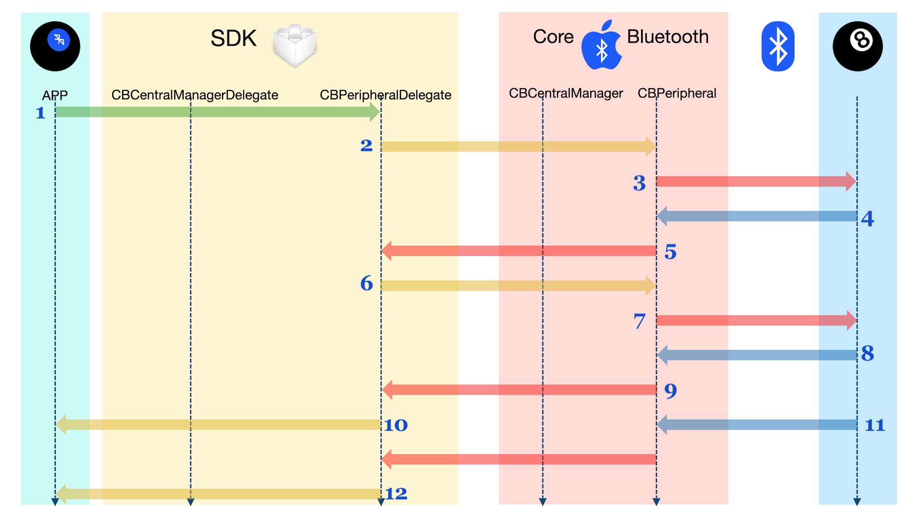

## PERIPHERAL DELEGATE IMPLEMENTATION (`01-SecondStep`)

At this point, we have completed the Central discovery and connection phases. Those were handled by [`CBCentralManager`](https://developer.apple.com/documentation/corebluetooth/cbcentralmanager), and [`CBCentralManagerDelegate`](https://developer.apple.com/documentation/corebluetooth/cbcentralmanagerdelegate).

They did the job of finding our peripheral[s], and establishing a connection to [it|them] (This means that the Peripherals are now dedicated to us, and are no longer advertising. They are just waiting for the Central to ask them questions).

In this step, we will implement the [`CBPeripheralDelegate`](https://developer.apple.com/documentation/corebluetooth/cbperipheraldelegate) conformance. There's a lot involved. Most of the Core Bluetooth action happens here.

## FIRST, LET'S SEE WHAT WE HAVE

If you haven't already, open the [`ITCB.xcworkspace` workspace](https://github.com/ChrisMarshallNY/ITCB-master/tree/master/01-SecondStep/ITCB.xcworkspace) with Xcode, and use the Project navigator to select the [`ITCB/src/Shared/internal/ITCB_SDK_Central_internal_Callbacks.swift`](https://github.com/ChrisMarshallNY/ITCB-master/blob/master/01-SecondStep/SDK-src/src/internal/ITCB_SDK_Central_internal_Callbacks.swift) file.

You should see something like this:

    import CoreBluetooth

    internal let _static_ITCB_SDK_8BallServiceUUID = CBUUID(string: "8E38140A-27BE-4090-8955-4FC4B5698D1E")
    internal let _static_ITCB_SDK_8BallService_Question_UUID = CBUUID(string: "BDD37D7A-F66A-47B9-A49C-FE29FD235A77")
    internal let _static_ITCB_SDK_8BallService_Answer_UUID = CBUUID(string: "349A0D7B-6215-4E2C-A095-AF078D737445")

    internal let _static_ITCB_SDK_RSSI_Min = -60
    internal let _static_ITCB_SDK_RSSI_Max = -20

    extension ITCB_SDK_Central {
        override var _managerInstance: Any! {
            get {
                if super._managerInstance == nil {
                    super._managerInstance = CBCentralManager(delegate: self, queue: nil)
                }
            
                return super._managerInstance
            }
        
            set {
                super._managerInstance = newValue
            }
        }
    }

    extension ITCB_SDK_Central: CBCentralManagerDelegate {
        public func centralManagerDidUpdateState(_ centralManager: CBCentralManager) {
            if centralManager.state == .poweredOn {
                print("Scanning for Peripherals")
                centralManager.scanForPeripherals(withServices: [_static_ITCB_SDK_8BallServiceUUID], options: nil)
            }
        }

        public func centralManager(_ centralManager: CBCentralManager, didDiscover peripheral: CBPeripheral, advertisementData: [String: Any], rssi: NSNumber) {
            if  !devices.contains(where: { $0.uuid == peripheral.identifier.uuidString }),
                let peripheralName = peripheral.name,
                !peripheralName.isEmpty,
                (_static_ITCB_SDK_RSSI_Min..._static_ITCB_SDK_RSSI_Max).contains(rssi.intValue) {
                print("Peripheral Discovered: \(peripheralName), RSSI: \(rssi)")
                devices.append(ITCB_SDK_Device_Peripheral(peripheral, owner: self))
                print("Connecting to \(peripheralName).")
                centralManager.connect(peripheral, options: nil)
            }
        }
    
        public func centralManager(_ centralManager: CBCentralManager, didConnect peripheral: CBPeripheral) {
            print("Successfully Connected to \(peripheral.name ?? "ERROR").")
            print("Discovering Services for \(peripheral.name ?? "ERROR").")
            peripheral.discoverServices([_static_ITCB_SDK_8BallServiceUUID])
        }
    }

Remember that we've removed comments, in order to reduce the size of these code listings.

## ON TO CODING

#### NEXT, The Actual Code

### STEP ONE: Establish Our [`CBPeripheralDelegate`](https://developer.apple.com/documentation/corebluetooth/cbperipheraldelegate) Conformance

We will need to establish five callbacks to manage the process of asking a question, and receiving the answer.

#### Discovery Callbacks

The first two callbacks are for the discovery phase, and are only executed when the device has been first discovered by the Central Manager.

If you remember from the first step, the last thing that the Central Manager did, was make the following call:

    peripheral.discoverServices([_static_ITCB_SDK_8BallServiceUUID])

That hands the baton over to the [`CBPeripheralDelegate`](https://developer.apple.com/documentation/corebluetooth/cbperipheraldelegate).

You didn't see it, but when we instantiated our internal [`ITCB_SDK_Device_Peripheral`](https://github.com/ChrisMarshallNY/ITCB-master/blob/master/01-SecondStep/SDK-src/src/internal/ITCB_SDK_Central_internal.swift#L125) instance, it set itself up as the delegate for the new Peripheral instance, which means that it will "catch" all the callbacks, going forward. It did that in the [`init(_:,owner:)`](https://github.com/ChrisMarshallNY/ITCB-master/blob/master/01-SecondStep/SDK-src/src/internal/ITCB_SDK_Central_internal.swift#L204) initializer.

So that means that the last thing the Central did, was tell the newly-created Peripheral to discover its Services, and report the results to its new delegate.

> ***NOTE:*** *We should be aware that a Peripheral won't automatically "know" which Services (and Characteristics, and so on) it has, until after it has "discovered" them, at the behest of the Central. Most Bluetooth entities are like this.*

##### Timeline of Discovery

1. Core Bluetooth Asks Peripheral To Discover Services
2. Peripheral Responds With Discovered Services
3. Core Bluetooth Calls CBPeripheralDelegate.peripheral(_:,didDiscoverServices:,error:)
4. The SDK Calls CBPeripheral.discoverCharacteristics(_:,for:)
5. Core Bluetooth Asks Peripheral To Discover Characteristics for Service
6. Peripheral responds With Discovered Characteristics
7. Core Bluetooth Calls CBPeripheralDelegate.peripheral(_:,didDiscoverCharacteristicsFor:,error:)
8. The SDK Informs the App That the Peripheral Is Ready For A Question

##### Service Discovery

Once Services are discovered, they are reported as "discovered" in the [`CBPeripheralDelegate.peripheral(_:, didDiscoverServices:)`](https://developer.apple.com/documentation/corebluetooth/cbperipheraldelegate/1518744-peripheral) callback.

Services are reported as discovered *en masse*. One call to [`CBPeripheral.discoverServices(_:)`](https://developer.apple.com/documentation/corebluetooth/cbperipheral/1518706-discoverservices) is matched by a callback to [`CBPeripheralDelegate.peripheral(_:, didDiscoverServices:)`](https://developer.apple.com/documentation/corebluetooth/cbperipheraldelegate/1518744-peripheral), and the Peripheral's [`services`](https://developer.apple.com/documentation/corebluetooth/cbperipheral/1518978-services) Array now has all the discovered Services. Prior to that, the [`services`](https://developer.apple.com/documentation/corebluetooth/cbperipheral/1518978-services) Array was undefined (either `nil`, or with "stale" data).

The original Service discovery request filtered for our "Magic 8-Ball" Service, so we should expect the [`services`](https://developer.apple.com/documentation/corebluetooth/cbperipheral/1518978-services) Array to have just one member. Nevertheless, we treat it as if it has many members.

So, at this point, we should add the following code, just below the `discoverServices(_:)` method code:

[This is a link to a gist, with the code ready to go.](https://gist.github.com/ChrisMarshallNY/80f3370d407f9b5f848077e5f2061894#file-01-secondstep-00-swift)

    extension ITCB_SDK_Device_Peripheral: CBPeripheralDelegate {
        public func peripheral(_ peripheral: CBPeripheral, didDiscoverServices error: Error?) {
            if let error = error {
                print("Encountered an error \(error) for the Peripheral \(peripheral.name ?? "ERROR")")
                owner?._sendErrorMessageToAllObservers(error: ITCB_Errors.coreBluetooth(error))
                return
            }
            print("Successfully Discovered \(peripheral.services?.count ?? 0) Services for \(peripheral.name ?? "ERROR").")
            peripheral.services?.forEach {
                print("Discovered Service: \($0.uuid.uuidString)")
                peripheral.discoverCharacteristics([_static_ITCB_SDK_8BallService_Question_UUID,
                                                    _static_ITCB_SDK_8BallService_Answer_UUID], for: $0)
            }
        }
    }

This is [the Services discovered callback](https://developer.apple.com/documentation/corebluetooth/cbperipheraldelegate/1518744-peripheral).

The first thing that we do, is check for an error. If there was one, we report it, and terminate the discovery.

If there was no error, we then apply a visitor to each of the discovered Services, and ask the Peripheral to discover its Characteristics, by calling the [`CBPeripheral.discoverCharacteristics(_:,for:)`](https://developer.apple.com/documentation/corebluetooth/cbperipheral/1518797-discovercharacteristics) method.

In this discovery request, we filter for our two Characteristic types ("question" and "answer").

> ***NOTE:*** *Take note that we are calling the **Peripheral** to discover the Characteristics, not the Service. This is where Core Bluetooth gets a bit "odd." It does not directly interact with the Services, Characteristics or Descriptors. Instead, it asks the Peripheral to do all the work, on behalf of its attributes.*

##### Characteristic Discovery

Now that we have discovered the Service and asked the Peripheral to perform a discovery on that Service for its two Characteristics, we should set up a callback to "catch" the Characteristic discovery.

Like the Service discovery callback, the results are "atomic." All Characteristics will be discovered at once. The Characteristic discovery callback is very similar to the Service discovery callback.

Just below the Service discovery callback, add the following code:

[This is a link to a gist, with the code ready to go.](https://gist.github.com/ChrisMarshallNY/80f3370d407f9b5f848077e5f2061894#file-01-secondstep-01-swift)

    public func peripheral(_ peripheral: CBPeripheral, didDiscoverCharacteristicsFor service: CBService, error: Error?) {
        if let error = error {
            print("Encountered an error \(error) for the Peripheral \(peripheral.name ?? "ERROR")")
            owner?._sendErrorMessageToAllObservers(error: ITCB_Errors.coreBluetooth(error))
            return
        }
        print("Successfully Discovered \(service.characteristics?.count ?? 0) Characteristics for the Service \(service.uuid.uuidString), on the Peripheral \(peripheral.name ?? "ERROR").")
        service.characteristics?.forEach {
            print("Discovered Characteristic: \($0.uuid.uuidString)")
        }
        owner.peripheralServicesUpdated(self)
    }

This is [the Characteristics discovered callback](https://developer.apple.com/documentation/corebluetooth/cbperipheraldelegate/1518821-peripheral).

Like we did with the Service discovery callback, the first thing we do is check for errors.

After that, we assume that we're done with this Peripheral (we only have one Service, and two Characteristics, so this is the last callback). We then inform our "owner" (the Central Manager) that we have discovered everything, and that it can tell the SDK user that the Peripheral is ready to answer questions.

At this point, the Peripheral is ready. It is connected to the Central, and is no longer advertising. The Peripheral knows about its "Magic 8-Ball" Service, and that Service knows about its two Characteristics ("question" and "answer").

#### Interaction Callbacks And Send Question Method

### STEP TWO: Add the [`sendQuestion(_:)`](https://gist.github.com/ChrisMarshallNY/80f3370d407f9b5f848077e5f2061894#file-01-secondstep-02-swift) method.

##### Timeline of Question/Answer

1. App calls SDK ITCB_SDK_Device_Peripheral.sendQuestion(_:)
2. SDK Calls CBPeripheral.setNotifyValue(_:,for:)
3. Core Bluetooth Asks Peripheral to Set the Notify Value for the Answer Characteristic
4. Peripheral Reports Characteristic Notify is On.
5. Core Bluetooth Calls CBPeripheralDelegate.peripheral(_:,didUpdateNotificationStateFor:,error:)
6. SDK Calls CBPeripheral.writeValue(_:,for:)
7. Core Bluetooth Asks peripheral to Set Value for Answer Characteristic, and Return Acknowledgment
8. Peripheral Acknowledges Question Value Set
9. Core Bluetooth Calls CBPeripheralDelegate.peripheral(_:,didWriteValueFor:,error:)
10. Peripheral Changes Value of Answer Characteristic and Notifies Core Bluetooth
11. Core Bluetooth Calls CBPeripheral.peripheral(_:,didUpdateValueFor:,error:)
12. The SDK notifies App that the Answer is Available

#### FIRST, the Backstory

Remember that local instances of [`CBPeripheral`](https://developer.apple.com/documentation/corebluetooth/cbperipheral) are *not actual one-to-one connections to remote devices*. They are a lot more akin to a "local directory" of the device, holding the "last known state" of the device, and information about its capabilities and data, along with directions for contacting the Peripheral.

##### We Have to Politely Ask the Peripheral to Set A Value

We don't actually "set" the value of the "question" Characteristic. Instead, *we send the new value to the Peripheral, and ask it to make it the new value of the Characteristic*. That's The Way of Bluetooth. The Peripheral is always in charge of its state.

##### A Cool Little Swift Trick

Another thing that we did before we got here, was [this little "hack"](https://github.com/ChrisMarshallNY/ITCB-master/blob/master/01-SecondStep/SDK-src/src/internal/ITCB_SDK_internal.swift#L147) (It's not actually a "hack." It's the way we do stuff in Swift):

[This is a link to a gist, with the code sample.](https://gist.github.com/ChrisMarshallNY/80f3370d407f9b5f848077e5f2061894#file-01-secondstep-arrayextension-swift)

    extension Array where Element: CBAttribute {
        public subscript(_ inUUIDString: String) -> Element! {
            for element in self where element.uuid.uuidString == inUUIDString {
                return element
            }
        
            return nil
        }
    }

That's [a constrained Array extension](https://littlegreenviper.com/miscellany/swiftwater/swift-extensions-part-three/), and we use it to look up Attributes (Characteristics and Services, in our case) in an Array by their [`CBUUID`](https://developer.apple.com/documentation/corebluetooth/cbuuid)

What we did, was add a subscript that accepts a [`String`](https://developer.apple.com/documentation/swift/string) as its argument, and then scans the Array, comparing the IDs, until it finds the one for which we're searching.

Note that we use the "colon" (":") qualifier. That means "[`CBAttribute`](https://developer.apple.com/documentation/corebluetooth/cbattribute)" *or any subclass of [`CBAttribute`](https://developer.apple.com/documentation/corebluetooth/cbattribute).* Since [`CBService`](https://developer.apple.com/documentation/corebluetooth/cbservice) and [`CBCharacteristic`](https://developer.apple.com/documentation/corebluetooth/cbcharacteristic) are both subclasses of [`CBAttribute`](https://developer.apple.com/documentation/corebluetooth/cbattribute), this will apply to either one of them.

Basically, it treats the Array like a `[`[`String`](https://developer.apple.com/documentation/swift/string)`: `[`CBAttribute`](https://developer.apple.com/documentation/corebluetooth/cbattribute)`]` Dictionary. Not super-efficient, but we don't need it to be. It will make the code we're about to write a lot simpler, by allowing us to search the built-in Arrays using [`CBUUID`](https://developer.apple.com/documentation/corebluetooth/cbuuid) Strings.

We also have a cached "[`question`](https://github.com/ChrisMarshallNY/ITCB-master/blob/master/01-SecondStep/SDK-src/src/internal/ITCB_SDK_Central_internal.swift#L138)" property (I normally advise against caching Bluetooth values, but this is really the best way to do this, while keeping this code simple). This will hold our outgoing question String.

> ***NOTE:*** *We don't actually set this until after the Peripheral has confirmed receipt of the string.*

And finally, we have a stored property called [`_peerInstance`](https://github.com/ChrisMarshallNY/ITCB-master/blob/master/01-SecondStep/SDK-src/src/internal/ITCB_SDK_internal.swift#L180), which holds a strong reference to either a [`CBCentral`](https://developer.apple.com/documentation/corebluetooth/cbcentral) or a  [`CBPeripheral`](https://developer.apple.com/documentation/corebluetooth/cbperipheral) (when operating in Peripheral Mode).

Note that this is a **strong** reference. We need it to be so, because this will hold our only reference to the entity. I won't go into much detail, but I wanted to mention it, as it makes an appearance below.

We should replace this:

    func sendQuestion(_ question: String) { }

with this:

[This is a link to a gist, with the code ready to go.](https://gist.github.com/ChrisMarshallNY/80f3370d407f9b5f848077e5f2061894#file-01-secondstep-02-swift)

    public func sendQuestion(_ inQuestion: String) {  
        question = nil  
        if  let data = inQuestion.data(using: .utf8),  
            let peripheral = _peerInstance as? CBPeripheral,  
            let service = peripheral.services?[_static_ITCB_SDK_8BallServiceUUID.uuidString],  
            let questionCharacteristic = service.characteristics?[_static_ITCB_SDK_8BallService_Question_UUID.uuidString],  
            let answerCharacteristic = service.characteristics?[_static_ITCB_SDK_8BallService_Answer_UUID.uuidString] {  
            _timeoutTimer = Timer.scheduledTimer(withTimeInterval: _timeoutLengthInSeconds, repeats: false) { [unowned self] (_) in  
                self._timeoutTimer = nil  
                self.owner?._sendErrorMessageToAllObservers(error: .sendFailed(ITCB_RejectionReason.deviceOffline))  
            }
            _interimQuestion = inQuestion  
            if answerCharacteristic.isNotifying {  
                print("Asking the Peripheral \(peripheral.name ?? "ERROR") the question \"\(_interimQuestion ?? "ERROR")\".")
                peripheral.writeValue(data, for: questionCharacteristic, type: .withResponse)
            } else {  
                print("Not yet asking the Peripheral \(peripheral.name ?? "ERROR") the question \"\(_interimQuestion ?? "ERROR")\", as we need to first set the answer Characteristic to notify.")
                peripheral.setNotifyValue(true, for: answerCharacteristic)
            }
        } else if inQuestion.data(using: .utf8) == nil {  
            print("Cannot send the question, because the question data is bad.")  
            self.owner?._sendErrorMessageToAllObservers(error: .sendFailed(ITCB_RejectionReason.unknown(nil)))  
        } else {  
            print("Cannot send the question, because the Peripheral may be offline, or have other problems.")  
            self.owner?._sendErrorMessageToAllObservers(error: .sendFailed(ITCB_RejectionReason.deviceOffline))  
        }
    }

That's quite a handful, eh? Let's walk through it.

[The first thing that we do](https://gist.github.com/ChrisMarshallNY/80f3370d407f9b5f848077e5f2061894#file-01-secondstep-00-swift-L2), is clear the [`question`](https://github.com/ChrisMarshallNY/ITCB-master/blob/master/01-SecondStep/SDK-src/src/internal/ITCB_SDK_Central_internal.swift#L138) property. It will only hold the question *after* it has been accepted by the Peripheral.

##### That Intricate `if... {}` Statement

Let's go through it, line-by-line:

###### [`let data = inQuestion.data(using: .utf8)`](https://gist.github.com/ChrisMarshallNY/80f3370d407f9b5f848077e5f2061894#file-01-secondstep-00-swift-L3)

First, we convert the String to a [`Data`](https://developer.apple.com/documentation/foundation/data) object. If that fails, the whole shooting match goes down the tubes.

###### [`let peripheral = _peerInstance as? CBPeripheral`](https://gist.github.com/ChrisMarshallNY/80f3370d407f9b5f848077e5f2061894#file-01-secondstep-00-swift-L4)

Next, we unwrap and cast the [`_peerInstance`](https://github.com/ChrisMarshallNY/ITCB-master/blob/master/01-SecondStep/SDK-src/src/internal/ITCB_SDK_internal.swift#L180) property to a [`CBPeripheral`](https://developer.apple.com/documentation/corebluetooth/cbperipheral) instance.

###### [`let service = peripheral.services?[_static_ITCB_SDK_8BallServiceUUID.uuidString]`](https://gist.github.com/ChrisMarshallNY/80f3370d407f9b5f848077e5f2061894#file-01-secondstep-00-swift-L5)

Next, we use one of those constrained Array extensions that we mentioned earlier, to get the "Magic 8-Ball" Service from the Peripheral.

###### [`let questionCharacteristic = service.characteristics?[_static_ITCB_SDK_8BallService_Question_UUID.uuidString]`](https://gist.github.com/ChrisMarshallNY/80f3370d407f9b5f848077e5f2061894#file-01-secondstep-00-swift-L6)

Next, we do the same for the "question" Characteristic.

###### [`let answerCharacteristic = service.characteristics?[_static_ITCB_SDK_8BallService_Answer_UUID.uuidString]`](https://gist.github.com/ChrisMarshallNY/80f3370d407f9b5f848077e5f2061894#file-01-secondstep-00-swift-L7)

And lastly, we do the same for the "answer" Characteristic.

##### We Need to Set Our Own Timeout

Core Bluetooth doesn't have a real timeout (actually, operations will fail, after a certain time, but it can take quite a while). We need to set our own timeout.

In reality, we should have set a timeout for the connection, as well, but I wanted to keep this demonstration as simple as possible.

Our timeout is a very simple "one-shot" timer that notifies all the observers of the SDK (beyond the scope of this demo) that there's been a timeout.

The timeout timer is maintained in the [`_timeoutTimer`](https://github.com/ChrisMarshallNY/ITCB-master/blob/master/01-SecondStep/SDK-src/src/internal/ITCB_SDK_Central_internal.swift#L132) property. We keep this, so we can invalidate the timer upon successful completion of the operation.

The timeout duration is defined in the [`_timeoutLengthInSeconds`](https://github.com/ChrisMarshallNY/ITCB-master/blob/master/01-SecondStep/SDK-src/src/internal/ITCB_SDK_Central_internal.swift#L127) constant.

So the first thing that we do, when we send a question, is establish a 1-second, "one-shot" timeout. When we are notified that the question was successfully asked, the timeout is invalidated, and set to `nil`.

##### We Need to Stash Our Question Until We Know It Was Asked, and the Peripheral is Ready to Answer

Next, we set the question being asked into an instance property called [`_interimQuestion`](https://github.com/ChrisMarshallNY/ITCB-master/blob/master/01-SecondStep/SDK-src/src/internal/ITCB_SDK_Central_internal.swift#L135).

This is a "staging area" for the question.

Remember how we don't actually change the value of a Characteristic; instead, asking the Peripheral to do it on our behalf?

We can't change the actual [`question`](https://github.com/ChrisMarshallNY/ITCB-master/blob/master/01-SecondStep/SDK-src/src/internal/ITCB_SDK_Central_internal.swift#L138) stored property, until we've been informed that the Peripheral has acceded to our demand, so we "stash" it here.

Also, we will need to set the Peripheral's "answer" Characteristic to "Notify", if it is not already notifying. If so, we then need to hold off asking the question until the Peripheral reports that the Characteristic has its "Notify" attribute set.

##### If the Answer Characteristic is Not Already Notifying, We Need to Set Up Notification for the Answer

If the Characteristic is not already notifying, we tell the "answer" Characteristic to notify us when it changes. We do that by setting its [`notify`](https://developer.apple.com/documentation/corebluetooth/cbperipheral/1518949-setnotifyvalue) value (again, we are asking the Peripheral to do this on our behalf).

##### Otherwise, We Ask the Peripheral to Set the Question Characteristic to the Question We Are Asking

If the "answer" Characteristic was already set to Notify, we actually ask the Peripheral to set the value of the "question" Characteristic to the question we are asking.

> ***NOTE:*** *Note that the [`CBPeripheral.writeValue(_:,for:,type:)`](https://developer.apple.com/documentation/corebluetooth/cbperipheral/1518747-writevalue) method is a **Peripheral** method; not a Characteristic method. As we will see, all Peripheral interactions, regardless of which attribute is being affected, go through the Peripheral object level.*

#### Don't Forget Errors

We do have a couple of quick tests for errors during this process. These are not likely to happen, but it's always a good idea to make sure we plan ahead.

The last three callbacks are the ones that are executed while the Central is asking questions, and the Peripheral is answering them.

##### Getting the Answer

There's two main ways to get the answer from the Peripheral: "Read" or "Notify".

###### Read

When we Read (using the [`CBPeripheral.readValue(for:)`](https://developer.apple.com/documentation/corebluetooth/cbperipheral/1518759-readvalue) method), the Central is in charge of the timing. It tells the Peripheral to update the Characteristic value *at the time the call is made*.

###### Notify

If we tell the Peripheral to set the Notify Flag on the "answer" Characteristic, we are asking the Peripheral to let us know whenever the value of the "answer" Characteristic changes.

This is done by calling the [`CBPeripheral.setNotifyValue(_:, for:)`](https://developer.apple.com/documentation/corebluetooth/cbperipheral/1518949-setnotifyvalue) method.

**BOTH** of these methods will result in the [`CBPeripheralDelegate.peripheral(_:didUpdateValueFor:error:)`](https://developer.apple.com/documentation/corebluetooth/cbperipheraldelegate/1518708-peripheral) callback being executed.

The difference is *when* the callback is made. If it is a response to the `readValue(for:)` method, it's predictable. What goes up, must come down. Not so, for the `setNotifyValue(_:, for:)` method.

I have chosen to use the "Notify" method, so, if you remember, we called [`CBPeripheral.setNotifyValue(_:, for:)`](https://developer.apple.com/documentation/corebluetooth/cbperipheral/1518949-setnotifyvalue) in the [`sendQuestion(_:)`](https://gist.github.com/ChrisMarshallNY/80f3370d407f9b5f848077e5f2061894#file-01-secondstep-00-swift-L16) method, above.

##### Notification

Before we go to the write, we may need to respond to notifications being enabled.

Below the Characteristic discovery callback, add the following code:

[This is a link to a gist, with the code ready to go.](https://gist.github.com/ChrisMarshallNY/80f3370d407f9b5f848077e5f2061894#file-01-secondstep-03-swift)

    public func peripheral(_ peripheral: CBPeripheral, didUpdateNotificationStateFor characteristic: CBCharacteristic, error: Error?) {

        if let error = error {
            owner?._sendErrorMessageToAllObservers(error: ITCB_Errors.coreBluetooth(error))
            return
        }

        if  let question = _interimQuestion,
            let data = question.data(using: .utf8),
            characteristic.isNotifying,
            let service = peripheral.services?[_static_ITCB_SDK_8BallServiceUUID.uuidString],
            let questionCharacteristic = service.characteristics?[_static_ITCB_SDK_8BallService_Question_UUID.uuidString] {
            print("The Peripheral's answer Characteristic is now notifying.")
            print("Asking the Peripheral \(peripheral.name ?? "ERROR") the question \"\(_interimQuestion ?? "ERROR")\".")
            peripheral.writeValue(data, for: questionCharacteristic, type: .withResponse)
        }
    }

This [callback responds to the "answer" Characteristic having its notification state changed](https://developer.apple.com/documentation/corebluetooth/cbperipheraldelegate/1518768-peripheral).

As before, the first thing we do, is check for errors, and respond, if there are any.

Then we extract the question from the interim question, and create a [`Data`](https://developer.apple.com/documentation/foundation/data) object from that.

After that, we examine the "answer" Characteristic, and see if its notification is already on.

If so, we then just make a write request, with the interim question, sending the request for the "question" Characteristic.

##### Write Confirmation

Now that the write has been made, we need to make sure it took.

Remember when I said that we don't actually write values, and, instead, ask the Peripheral to do it for us? Remember [`_interimQuestion`](https://github.com/ChrisMarshallNY/ITCB-master/blob/master/01-SecondStep/SDK-src/src/internal/ITCB_SDK_Central_internal.swift#L135)?

In the [`sendQuestion(_:)`](https://gist.github.com/ChrisMarshallNY/80f3370d407f9b5f848077e5f2061894#file-01-secondstep-00-swift-L14) method, above, we asked the Peripheral to set the "question" Characteristic, of the "Magic 8-Ball" Service, to the question that we asked.

This sent the string (the question is a string) over to the Peripheral, telling it what Characteristic we wanted to modify.

Assuming that went well, the Peripheral should respond* to our request, telling us that the write was successful. At that point, the question moves from an "interim" status to a "final" status (the [`question`](https://github.com/ChrisMarshallNY/ITCB-master/blob/master/01-SecondStep/SDK-src/src/internal/ITCB_SDK_Central_internal.swift#L138) property is set).

> ****NOTE:*** _There are two ways we can do a "write" with Bluetooth: [`.withResponse`](https://developer.apple.com/documentation/corebluetooth/cbcharacteristicwritetype/withresponse), and [`.withoutResponse`](https://developer.apple.com/documentation/corebluetooth/cbcharacteristicwritetype/withoutresponse). These denote whether or not we can expect the Peripheral to acknowledge receipt of the write. **THIS CALLBACK WILL NOT HAPPEN UNLESS WE SEND THE WRITE AS [`.withResponse`](https://developer.apple.com/documentation/corebluetooth/cbcharacteristicwritetype/withresponse)**._

We don't actually do much with this information. We'll show it to the user, when we display the results, but it is more of a demonstrative exercise.

Below the Notification Change callback, add the following code:

[This is a link to a gist, with the code ready to go.](https://gist.github.com/ChrisMarshallNY/80f3370d407f9b5f848077e5f2061894#file-01-secondstep-04-swift)

    public func peripheral(_ peripheral: CBPeripheral, didWriteValueFor characteristic: CBCharacteristic, error: Error?) {
        guard let error = error else {
            print("Characteristic \(characteristic.uuid.uuidString) reports that its value was accepted by the Peripheral.")
            if let questionString = _interimQuestion {
                _interimQuestion = nil
                question = questionString
            } else {
                owner?._sendErrorMessageToAllObservers(error: .sendFailed(ITCB_RejectionReason.peripheralError(nil)))
            }
            
            return
        }
        
        _timeoutTimer?.invalidate()
        _timeoutTimer = nil
        
        if let error = error as? CBATTError {
            print("Encountered an error \(error) for the Peripheral \(peripheral.name ?? "ERROR")")
            switch error {
            case CBATTError.unlikelyError:
                owner?._sendErrorMessageToAllObservers(error: .sendFailed(ITCB_Errors.coreBluetooth(ITCB_RejectionReason.questionPlease)))

            default:
                owner?._sendErrorMessageToAllObservers(error: .sendFailed(ITCB_Errors.coreBluetooth(ITCB_RejectionReason.peripheralError(error))))
            }
        } else {
            owner?._sendErrorMessageToAllObservers(error: .sendFailed(ITCB_RejectionReason.unknown(error)))
        }
    }

This is [the write confirmation callback](https://developer.apple.com/documentation/corebluetooth/cbperipheraldelegate/1518823-peripheral).

> ***NOTE:*** *At this point, even though we have received confirmation of the write, **the [`CBCharacteristic.value`](https://developer.apple.com/documentation/corebluetooth/cbcharacteristic/1518878-value) property is not valid!**. The only valid instance we have of the value that we sent is in [`_interimQuestion`](https://github.com/ChrisMarshallNY/ITCB-master/blob/master/01-SecondStep/SDK-src/src/internal/ITCB_SDK_Central_internal.swift#L135). If we want to have a valid value, then we need to [send a read request to the Peripheral](https://developer.apple.com/documentation/corebluetooth/cbperipheral/1518759-readvalue), and wait for it to set that property.*

The first thing that we do, is invalidate the timeout. Remember that we set a timeout when we sent the question? Now that we are back, we don't need the timeout. There may be errors, but a timeout isn't one of them.

The next thing we do, is look for the **absence** of an error. If there is none, then we can simply assume that the write was accepted, and set the [`question`](https://github.com/ChrisMarshallNY/ITCB-master/blob/master/01-SecondStep/SDK-src/src/internal/ITCB_SDK_Central_internal.swift#L138) property to the interim question. We use a `guard` statement for this, with the `else { }` block being our "success" indicator.

The rest of this method is looking for errors.

> ***NOTE:*** *In device communications, error checking is vital! We are actually being quite "casual" about error checking, here, as I don't want to add too much "noise" to the lesson.*

##### Receiving the Answer

Lastly, we need to get the answer from the Peripheral.

After the write confirmation callback method, add the following code:

[This is a link to a gist, with the code ready to go.](https://gist.github.com/ChrisMarshallNY/80f3370d407f9b5f848077e5f2061894#file-01-secondstep-05-swift)

    public func peripheral(_ peripheral: CBPeripheral, didUpdateValueFor characteristic: CBCharacteristic, error: Error?) {
        _timeoutTimer?.invalidate()
        _timeoutTimer = nil
        if let error = error {
            print("Encountered an error \(error) for the Peripheral \(peripheral.name ?? "ERROR")")
            owner?._sendErrorMessageToAllObservers(error: ITCB_Errors.coreBluetooth(error))
            return
        }
        print("Characteristic \(characteristic.uuid.uuidString) Updated its value to \(String(describing: characteristic.value)).")
        if  let answerData = characteristic.value,
            let answerString = String(data: answerData, encoding: .utf8),
            !answerString.isEmpty {
            peripheral.setNotifyValue(false, for: characteristic)
            answer = answerString
        }
    }

This is [the value updated callback](https://developer.apple.com/documentation/corebluetooth/cbperipheraldelegate/1518708-peripheral) (made when the value of the "answer" Characteristic has been updated).

As before, the first thing we do, is clear the timeout.

Then, we check for errors, notifying the SDK user, and terminating the process if one is encountered.

Finally, we get the new answer from the Characteristic.

The answer will be in a [`Data`](https://developer.apple.com/documentation/foundation/data) format, so we need to convert that to a UTF-8 String, and set our ["`answer`"](https://github.com/ChrisMarshallNY/ITCB-master/blob/master/01-SecondStep/SDK-src/src/internal/ITCB_SDK_Central_internal.swift#L146) variable to that. The ["`answer`"](https://github.com/ChrisMarshallNY/ITCB-master/blob/master/01-SecondStep/SDK-src/src/internal/ITCB_SDK_Central_internal.swift#L146) property has a `didSet` observer that will notify the SDK user there is an answer:

    public var answer: String! = nil {
        didSet {
            owner?._sendQuestionAnsweredMessageToAllObservers(device: self)
        }
    }

So just setting the value is enough to let the SDK user know there is a new answer.

## AND THAT'S IT

We have now added all the code that was necessary to finalize the Central implementation of the Magic 8-Ball app.

Try running an instance on the Mac, and run that as Peripheral Mode. Then, run the app on another device, and run that as Central Mode (in the case of Watch or TV, this will happen automatically. For iOS, you will need to select "Central").

After a few seconds (sometimes, *quite* a few), you will see the name of your Mac show up in the Central list.

If all has gone well, you can tap on that list row, ask a question of the "Magic 8-Ball" device, and get a randomly-selected answer. The Mac will display the question that it received, and the answer it sent, in a modal alert.

## RECAP

The [`ITCB/src/Shared/internal/ITCB_SDK_Central_internal_Callbacks.swift`](https://github.com/ChrisMarshallNY/ITCB-master/blob/master/01-SecondStep/SDK-src/src/internal/ITCB_SDK_Central_internal_Callbacks.swift) file should now look more or less like this:

    import CoreBluetooth

    internal let _static_ITCB_SDK_8BallServiceUUID = CBUUID(string: "8E38140A-27BE-4090-8955-4FC4B5698D1E")
    internal let _static_ITCB_SDK_8BallService_Question_UUID = CBUUID(string: "BDD37D7A-F66A-47B9-A49C-FE29FD235A77")
    internal let _static_ITCB_SDK_8BallService_Answer_UUID = CBUUID(string: "349A0D7B-6215-4E2C-A095-AF078D737445")

    internal let _static_ITCB_SDK_RSSI_Min = -60
    internal let _static_ITCB_SDK_RSSI_Max = -20

    extension ITCB_SDK_Central {
        override var _managerInstance: Any! {
            get {
                if super._managerInstance == nil {
                    super._managerInstance = CBCentralManager(delegate: self, queue: nil)
                }
            
                return super._managerInstance
            }
        
            set {
                super._managerInstance = newValue
            }
        }
    }

    extension ITCB_SDK_Central: CBCentralManagerDelegate {
        public func centralManagerDidUpdateState(_ centralManager: CBCentralManager) {
            if .poweredOn == centralManager.state {
                print("Scanning for Peripherals")
                centralManager.scanForPeripherals(withServices: [_static_ITCB_SDK_8BallServiceUUID], options: nil)
            }
        }

        public func centralManager(_ centralManager: CBCentralManager, didDiscover peripheral: CBPeripheral, advertisementData: [String: Any], rssi: NSNumber) {
            if  !devices.contains(where: { $0.uuid == peripheral.identifier.uuidString }),
                let peripheralName = peripheral.name,
                !peripheralName.isEmpty,
                (_static_ITCB_SDK_RSSI_Min..._static_ITCB_SDK_RSSI_Max).contains(rssi.intValue) {
                print("Peripheral Discovered: \(peripheralName), RSSI: \(rssi)")
                devices.append(ITCB_SDK_Device_Peripheral(peripheral, owner: self))
                print("Connecting to \(peripheralName).")
                centralManager.connect(peripheral, options: nil)
            }
        }
    
        public func centralManager(_ centralManager: CBCentralManager, didConnect peripheral: CBPeripheral) {
            print("Successfully Connected to \(peripheral.name ?? "ERROR").")
            print("Discovering Services for \(peripheral.name ?? "ERROR").")
            peripheral.discoverServices([_static_ITCB_SDK_8BallServiceUUID])
        }
    }

    extension ITCB_SDK_Device_Peripheral {
        public func sendQuestion(_ inQuestion: String) {
            question = nil
            if  let data = inQuestion.data(using: .utf8),
                let peripheral = _peerInstance as? CBPeripheral,
                let service = peripheral.services?[_static_ITCB_SDK_8BallServiceUUID.uuidString],
                let questionCharacteristic = service.characteristics?[_static_ITCB_SDK_8BallService_Question_UUID.uuidString],
                let answerCharacteristic = service.characteristics?[_static_ITCB_SDK_8BallService_Answer_UUID.uuidString] {
                _timeoutTimer = Timer.scheduledTimer(withTimeInterval: _timeoutLengthInSeconds, repeats: false) { [unowned self] (_) in
                    self._timeoutTimer = nil
                    self.owner?._sendErrorMessageToAllObservers(error: .sendFailed(ITCB_RejectionReason.deviceOffline))
                }
                _interimQuestion = inQuestion
                if answerCharacteristic.isNotifying {  
                    print("Asking the Peripheral \(peripheral.name ?? "ERROR") the question \"\(_interimQuestion ?? "ERROR")\".")
                    peripheral.writeValue(data, for: questionCharacteristic, type: .withResponse)
                } else {  
                    print("Not yet asking the Peripheral \(peripheral.name ?? "ERROR") the question \"\(_interimQuestion ?? "ERROR")\", as we need to first set the answer Characteristic to notify.")
                    peripheral.setNotifyValue(true, for: answerCharacteristic)
                }
            } else if inQuestion.data(using: .utf8) == nil {
                print("Cannot send the question, because the question data is bad.")
                self.owner?._sendErrorMessageToAllObservers(error: .sendFailed(ITCB_RejectionReason.unknown(nil)))
            } else {
                print("Cannot send the question, because the Peripheral may be offline, or have other problems.")
                self.owner?._sendErrorMessageToAllObservers(error: .sendFailed(ITCB_RejectionReason.deviceOffline))
            }
        }

        public func peripheral(_ peripheral: CBPeripheral, didDiscoverServices error: Error?) {
            if let error = error {
                print("Encountered an error \(error) for the Peripheral \(peripheral.name ?? "ERROR")")
                _timeoutTimer?.invalidate()
                _timeoutTimer = nil
                owner?._sendErrorMessageToAllObservers(error: ITCB_Errors.coreBluetooth(error))
                return
            }
            print("Successfully Discovered \(peripheral.services?.count ?? 0) Services for \(peripheral.name ?? "ERROR").")
            peripheral.services?.forEach {
                peripheral.discoverCharacteristics([_static_ITCB_SDK_8BallService_Question_UUID,
                                                    _static_ITCB_SDK_8BallService_Answer_UUID], for: $0)
            }
        }
    
        public func peripheral(_ peripheral: CBPeripheral, didDiscoverCharacteristicsFor service: CBService, error: Error?) {
            if let error = error {
                print("Encountered an error \(error) for the Peripheral \(peripheral.name ?? "ERROR")")
                _timeoutTimer?.invalidate()
                _timeoutTimer = nil
                owner?._sendErrorMessageToAllObservers(error: ITCB_Errors.coreBluetooth(error))
                return
            }
            print("Successfully Discovered \(service.characteristics?.count ?? 0) Characteristics for the Service \(service.uuid.uuidString), on the Peripheral \(peripheral.name ?? "ERROR").")
            owner.peripheralServicesUpdated(self)
        }
    
        public func peripheral(_ peripheral: CBPeripheral, didUpdateNotificationStateFor characteristic: CBCharacteristic, error: Error?) {

            if let error = error {
                owner?._sendErrorMessageToAllObservers(error: ITCB_Errors.coreBluetooth(error))
                return
            }

            if  let question = _interimQuestion,
                let data = question.data(using: .utf8),
                characteristic.isNotifying,
                let service = peripheral.services?[_static_ITCB_SDK_8BallServiceUUID.uuidString],
                let questionCharacteristic = service.characteristics?[_static_ITCB_SDK_8BallService_Question_UUID.uuidString] {
                print("Asking the Peripheral \(peripheral.name ?? "ERROR") the question \"\(_interimQuestion ?? "ERROR")\".")
                peripheral.writeValue(data, for: questionCharacteristic, type: .withResponse)
            }
        }

        public func peripheral(_ peripheral: CBPeripheral, didWriteValueFor characteristic: CBCharacteristic, error: Error?) {
            guard let error = error else {
                print("Characteristic \(characteristic.uuid.uuidString) reports that its value was accepted by the Peripheral.")
                if let questionString = _interimQuestion {
                    _interimQuestion = nil
                    question = questionString
                } else {
                    owner?._sendErrorMessageToAllObservers(error: .sendFailed(ITCB_RejectionReason.peripheralError(nil)))
                }
            
                return
            }
        
            _timeoutTimer?.invalidate()
            _timeoutTimer = nil
        
            if let error = error as? CBATTError {
                print("Encountered an error \(error) for the Peripheral \(peripheral.name ?? "ERROR")")
                switch error {
                case CBATTError.unlikelyError:
                    owner?._sendErrorMessageToAllObservers(error: .sendFailed(ITCB_Errors.coreBluetooth(ITCB_RejectionReason.questionPlease)))

                default:
                    owner?._sendErrorMessageToAllObservers(error: .sendFailed(ITCB_Errors.coreBluetooth(ITCB_RejectionReason.peripheralError(error))))
                }
            } else {
                owner?._sendErrorMessageToAllObservers(error: .sendFailed(ITCB_RejectionReason.unknown(error)))
            }
        }

        public func peripheral(_ peripheral: CBPeripheral, didUpdateValueFor characteristic: CBCharacteristic, error: Error?) {
            _timeoutTimer?.invalidate()
            _timeoutTimer = nil
            if let error = error {
                print("Encountered an error \(error) for the Peripheral \(peripheral.name ?? "ERROR")")
                owner?._sendErrorMessageToAllObservers(error: ITCB_Errors.coreBluetooth(error))
                return
            }
            print("Characteristic \(characteristic.uuid.uuidString) Updated its value to \(String(describing: characteristic.value)).")
            if  let answerData = characteristic.value,
                let answerString = String(data: answerData, encoding: .utf8),
                !answerString.isEmpty {
                peripheral.setNotifyValue(false, for: characteristic)
                answer = answerString
            }
        }
    }

Remember that we have removed comments, in order to reduce the vertical footprint of all this text.

# REFERENCES

- [The Git Repo Location for This Step](https://github.com/ChrisMarshallNY/ITCB-master/tree/master/01-SecondStep)
- [Apple CBPeripheral Documentation](https://developer.apple.com/documentation/corebluetooth/cbperipheral)
- [Apple CBPeripheralDelegate Documentation](https://developer.apple.com/documentation/corebluetooth/cbperipheraldelegate)
- [Apple CBService Documentation](https://developer.apple.com/documentation/corebluetooth/cbservice)
- [Apple CBCharacteristic Documentation](https://developer.apple.com/documentation/corebluetooth/cbcharacteristic)
