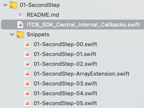
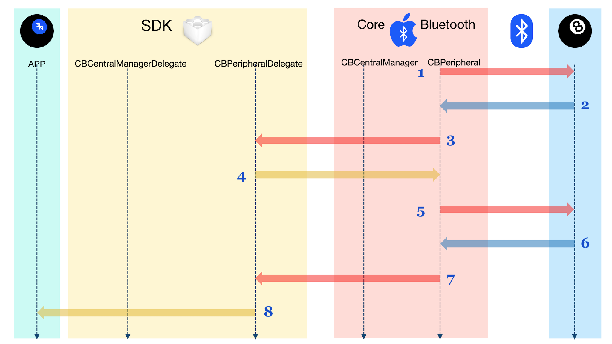

## PERIPHERAL DELEGATE IMPLEMENTATION (`01-SecondStep`)

At this point, we have completed the Central discovery and connection phases. Those were handled by [`CBCentralManager`](https://developer.apple.com/documentation/corebluetooth/cbcentralmanager), and [`CBCentralManagerDelegate`](https://developer.apple.com/documentation/corebluetooth/cbcentralmanagerdelegate).

They did the job of finding our peripheral[s], and establishing a connection to [it|them] (This means that the Peripherals are now dedicated to us, and are no longer advertising. They are just waiting for the Central to ask them questions).

In this step, we will implement the [`CBPeripheralDelegate`](https://developer.apple.com/documentation/corebluetooth/cbperipheraldelegate) conformance. There's a lot involved. Most of the Core Bluetooth action happens here.

## FIRST, LET'S SEE WHAT WE HAVE

If you haven't already, open the [`ITCB.xcworkspace` workspace](https://github.com/ChrisMarshallNY/ITCB-master/tree/master/01-SecondStep/ITCB.xcworkspace) with Xcode, and use the Project navigator to select [the `01-SecondStep/ITCB_SDK_Central_internal_Callbacks.swift` file](https://github.com/ChrisMarshallNY/ITCB-master/blob/master/01-SecondStep/SDK-src/src/internal/ITCB_SDK_Central_internal_Callbacks.swift) (which is an alias of [the `01-SecondStep/SDK-src/src/internal/ITCB_SDK_Central_internal_Callbacks.swift` file](https://github.com/ChrisMarshallNY/ITCB-master/blob/master/01-SecondStep/SDK-src/src/internal/ITCB_SDK_Central_internal_Callbacks.swift)).

You should see something like this (Remember that we are removing comments, to keep the code dumps manageable):

    import CoreBluetooth

    internal let _static_ITCB_SDK_8BallServiceUUID = CBUUID(string: "8E38140A-27BE-4090-8955-4FC4B5698D1E")
    internal let _static_ITCB_SDK_8BallService_Question_UUID = CBUUID(string: "BDD37D7A-F66A-47B9-A49C-FE29FD235A77")
    internal let _static_ITCB_SDK_8BallService_Answer_UUID = CBUUID(string: "349A0D7B-6215-4E2C-A095-AF078D737445")

    internal let _static_ITCB_SDK_RSSI_Min = -60
    internal let _static_ITCB_SDK_RSSI_Max = -20

    extension ITCB_SDK_Central {
        override var _managerInstance: Any! {
            get {
                if super._managerInstance == nil {
                    print("Creating A new instance of CBCentralManager.")
                    super._managerInstance = CBCentralManager(delegate: self, queue: nil)
                }
            
                return super._managerInstance
            }
        
            set {
                super._managerInstance = newValue
            }
        }
    }

    extension ITCB_SDK_Central: CBCentralManagerDelegate {
        public func centralManagerDidUpdateState(_ centralManager: CBCentralManager) {
            if centralManager.state == .poweredOn {
                print("Scanning for Peripherals")
                centralManager.scanForPeripherals(withServices: [_static_ITCB_SDK_8BallServiceUUID], options: nil)
            }
        }

        public func centralManager(_ centralManager: CBCentralManager, didDiscover peripheral: CBPeripheral, advertisementData: [String: Any], rssi: NSNumber) {
            if  !devices.contains(where: { $0.uuid == peripheral.identifier.uuidString }),
                let peripheralName = peripheral.name,
                !peripheralName.isEmpty,
                (_static_ITCB_SDK_RSSI_Min..._static_ITCB_SDK_RSSI_Max).contains(rssi.intValue) {
                print("Peripheral Discovered: \(peripheralName), RSSI: \(rssi)")
                devices.append(ITCB_SDK_Device_Peripheral(peripheral, owner: self))
                print("Connecting to \(peripheralName).")
                centralManager.connect(peripheral, options: nil)
            }
        }
    
        public func centralManager(_ centralManager: CBCentralManager, didConnect peripheral: CBPeripheral) {
            print("Successfully Connected to \(peripheral.name ?? "ERROR").")
            print("Discovering Services for \(peripheral.name ?? "ERROR").")
            peripheral.discoverServices([_static_ITCB_SDK_8BallServiceUUID])
        }
    }

## ON TO CODING

### The Snippets

We will be copying (and pasting) pre-written snippets of code, supplied in [a GitHub Gist](https://gist.github.com/ChrisMarshallNY/80f3370d407f9b5f848077e5f2061894), and also embedded in the main workspace (see image, below). The snippets will be pasted into [the `ITCB/src/Shared/internal/ITCB_SDK_Central_internal_Callbacks.swift` file](https://github.com/ChrisMarshallNY/ITCB-master/blob/master/01-SecondStep/SDK-src/src/internal/ITCB_SDK_Central_internal_Callbacks.swift), which will integrate the new code into the ITCB SDK project, which will integrate into the "Magic 8-Ball" app.


*Figure 1: The Snippets*

### MAIN GOAL: Implementing [the `CBPeripheralDelegate` Protocol](https://developer.apple.com/documentation/corebluetooth/cbperipheraldelegate), which will complete the SDK.

1. We will continue to extend [the `ITCB_SDK_Central` class](https://github.com/ChrisMarshallNY/ITCB-master/blob/master/00-StartingPoint/SDK-src/src/public/ITCB_SDK.swift#L130); this time, by conforming it to [the `CBPeripheralDelegate` protocol](https://developer.apple.com/documentation/corebluetooth/cbperipheraldelegate).
2. We will add code to receive [the `CBPeripheralDelegate.peripheral(_:didDiscoverServices:)` delegate callback](https://developer.apple.com/documentation/corebluetooth/cbperipheraldelegate/1518744-peripheral), which is in response to the last step of Phase 1. The response we receive will have the Magic 8-Ball Service.
3. This code will then issue [the `CBPeripheral.discoverCharacteristics(_:for:)` call](https://developer.apple.com/documentation/corebluetooth/cbperipheral/1518797-discovercharacteristics), asking the Perippheral to discover all [the `CBCharacteristic` instances](https://developer.apple.com/documentation/corebluetooth/cbcharacteristic) for the Magic 8-Ball Service.
4. We will add code to receive [the `CBPeripheralDelegate.peripheral(_:didDiscoverCharacteristicsFor:error:)` callback](https://developer.apple.com/documentation/corebluetooth/cbperipheraldelegate/1518821-peripheral), which will return 2 instances of [`CBCharacteristic`](https://developer.apple.com/documentation/corebluetooth/cbcharacteristic); representing the 2 "parts" of the Magic 8-Ball Central implementation (ask question/receive answer).
5. At this point, the Central will have a full "map" of the Peripheral, and will call [the `ITCB_Observer_Central_Protocol.deviceDiscovered(_ device:)` SDK observer method](https://github.com/ChrisMarshallNY/ITCB-master/blob/master/01-SecondStep/SDK-src/src/public/ITCB_SDK_Protocol.swift#L307). The app will then present the device to the user, who will be prompted to ask a question.
6. We will then add code to the SDK, to implement [the `ITCB_Device_Peripheral_Protocol.sendQuestion(_:)` method](https://github.com/ChrisMarshallNY/ITCB-master/blob/master/01-SecondStep/SDK-src/src/public/ITCB_SDK_Protocol.swift#L239).
7. Upon the user asking a question of the Peripheral (via the app interface), the SDK will have [its `ITCB_Device_Peripheral_Protocol.sendQuestion(_:)` method](https://gist.github.com/ChrisMarshallNY/80f3370d407f9b5f848077e5f2061894#file-01-secondstep-02-swift-L2) called, with the question string, to be sent to the Peripheral.
8. This code will first set Core Bluetooth to receive notifications from the Peripheral by calling [`CBPeripheral.setNotifyValue(_:for:)`](https://developer.apple.com/documentation/corebluetooth/cbperipheral/1518949-setnotifyvalue), and will wait for confirmation of the notification (via [the `CBPeripheralDelegate.peripheral(_:didUpdateNotificationStateFor:error:)` delegate callback](https://developer.apple.com/documentation/corebluetooth/cbperipheraldelegate/1518768-peripheral), before sending the question to the Peripheral.
9. Upon receiving confirmation that the notifications are ready, the SDK will use [the `CBPeripheral.writeValue(_:for:type:)` method](https://developer.apple.com/documentation/corebluetooth/cbperipheral/1518747-writevalue) to send the question to the Peripheral, and will await a response, via [the `CBPeripheralDelegate.peripheral(_:didUpdateValueFor:error:)` delegate callback](https://developer.apple.com/documentation/corebluetooth/cbperipheraldelegate/1518708-peripheral).
10. After successfuly sending the question, the code will send [the `ITCB_Observer_Central_Protocol.questionAskedOfDevice(_:)` message](https://github.com/ChrisMarshallNY/ITCB-master/blob/master/01-SecondStep/SDK-src/src/public/ITCB_SDK_Protocol.swift#L297), confirming to the app, that the question was sent to the Peripheral.
11. We will add the code to receive the notification from the Peripheral ([the `CBPeripheralDelegate.peripheral(_:didUpdateValueFor:error:)` delegate callback](https://developer.apple.com/documentation/corebluetooth/cbperipheraldelegate/1518708-peripheral)).
12. This code will call [the `ITCB_Observer_Central_Protocol.questionAnsweredByDevice(_:)` SDK observer callback](https://github.com/ChrisMarshallNY/ITCB-master/blob/master/01-SecondStep/SDK-src/src/public/ITCB_SDK_Protocol.swift#L287), informing the app that the question answer was received.

### STEP ONE: Establish Our [`CBPeripheralDelegate`](https://developer.apple.com/documentation/corebluetooth/cbperipheraldelegate) Conformance

We will need to establish five callbacks to manage the process of asking a question, and receiving the answer.

#### Discovery Callbacks

The first two callbacks are for the discovery phase, and are only executed when the device has been first discovered by the Central Manager.

If you remember from Phase One, the last thing that the Central Manager did, was make [the following call](https://github.com/ChrisMarshallNY/ITCB-master/blob/master/01-SecondStep/SDK-src/src/internal/ITCB_SDK_Central_internal_Callbacks.swift#L77):

    peripheral.discoverServices([_static_ITCB_SDK_8BallServiceUUID])

That hands the baton over to the [`CBPeripheralDelegate`](https://developer.apple.com/documentation/corebluetooth/cbperipheraldelegate).

You didn't see it, but [when we instantiated](https://github.com/ChrisMarshallNY/ITCB-master/blob/master/01-SecondStep/SDK-src/src/internal/ITCB_SDK_Central_internal.swift#L204) our internal [`ITCB_SDK_Device_Peripheral`](https://github.com/ChrisMarshallNY/ITCB-master/blob/master/01-SecondStep/SDK-src/src/internal/ITCB_SDK_Central_internal.swift#L125) instance, [it set itself up as the delegate for the new Peripheral instance](https://github.com/ChrisMarshallNY/ITCB-master/blob/master/01-SecondStep/SDK-src/src/internal/ITCB_SDK_Central_internal.swift#L206), which means that it will "catch" all the callbacks, going forward. It did that in the [`init(_:,owner:)`](https://github.com/ChrisMarshallNY/ITCB-master/blob/master/01-SecondStep/SDK-src/src/internal/ITCB_SDK_Central_internal.swift#L204) initializer.

So that means that the last thing the Central did, was tell the newly-created Peripheral to discover its Services, and report the results to its new delegate.

> ***NOTE:*** *We should be aware that a Peripheral won't automatically "know" which Services (and Characteristics, and so on) it has, until after it has "discovered" them, at the behest of the Central. Most Bluetooth entities are like this.*

#### WE ARE DONE WITH CENTRAL

As of the start of this phase, all interactions will now be with methods that conform to [the `CBPeripheralDelegate` protocol](https://developer.apple.com/documentation/corebluetooth/cbperipheraldelegate). We are done with [the `CBCentralManagerDelegate` protocol](https://developer.apple.com/documentation/corebluetooth/cbcentralmanagerdelegate).

##### Timeline of Discovery


*Figure 2: The Timeline of the First Part*

1. Core Bluetooth asks the Peripheral to discover its services.
2. The Peripheral responds with the discovered Services.
3. Core Bluetooth then calls [the `CBPeripheralDelegate.peripheral(_:didDiscoverServices:)` delegate callback](https://developer.apple.com/documentation/corebluetooth/cbperipheraldelegate/1518744-peripheral).
4. The SDK, in turn, calls [`CBPeripheral.discoverCharacteristics(_:for:)`](https://developer.apple.com/documentation/corebluetooth/cbperipheral/1518797-discovercharacteristics), asking the Peripheral to discover the Characteristics for the discovered Service (Magic 8-Ball).
5. Core Bluetooth asks the Peripheral to discover the Characteristics for the Magic 8-Ball Service.
6. The Peripheral responds with the two discovered Characteristics (Question and Answer).
7. Core Bluetooth calls [the `CBPeripheralDelegate.peripheral(_:didDiscoverCharacteristicsFor:error:)` callback](https://developer.apple.com/documentation/corebluetooth/cbperipheraldelegate/1518821-peripheral).
8. The SDK informs the app that the Peripheral is ready for a question, by calling [the `ITCB_Observer_Central_Protocol.deviceDiscovered(_ device:)` SDK observer method](https://github.com/ChrisMarshallNY/ITCB-master/blob/master/01-SecondStep/SDK-src/src/public/ITCB_SDK_Protocol.swift#L307).

At the end of all this, the app will display the Peripheral in a list, and the user will be allowed to select the Peripheral, and type a question, to be sent to the Peripheral (at this point, nothing happens, beyond that).

##### Service Discovery

Once Services are discovered, they are reported as "discovered" in the [`CBPeripheralDelegate.peripheral(_:, didDiscoverServices:)`](https://developer.apple.com/documentation/corebluetooth/cbperipheraldelegate/1518744-peripheral) callback.

Services are reported as discovered *en masse*. One call to [`CBPeripheral.discoverServices(_:)`](https://developer.apple.com/documentation/corebluetooth/cbperipheral/1518706-discoverservices) is matched by a callback to [`CBPeripheralDelegate.peripheral(_:, didDiscoverServices:)`](https://developer.apple.com/documentation/corebluetooth/cbperipheraldelegate/1518744-peripheral), and the Peripheral's [`services`](https://developer.apple.com/documentation/corebluetooth/cbperipheral/1518978-services) Array now has all the discovered Services. Prior to that, the [`services`](https://developer.apple.com/documentation/corebluetooth/cbperipheral/1518978-services) Array was undefined (either `nil`, or with "stale" data).

The original Service discovery request filtered for our "Magic 8-Ball" Service, so we should expect the [`services`](https://developer.apple.com/documentation/corebluetooth/cbperipheral/1518978-services) Array to have just one member. Nevertheless, we treat it as if it has many members.

So, at this point, we should add the following code, just below the `discoverServices(_:)` method code (This is in [the `01-SecondStep-00.swift` snippet file](https://gist.github.com/ChrisMarshallNY/80f3370d407f9b5f848077e5f2061894#file-01-secondstep-00-swift)):
```
    extension ITCB_SDK_Device_Peripheral: CBPeripheralDelegate {
        public func peripheral(_ peripheral: CBPeripheral, didDiscoverServices error: Error?) {
            if let error = error {
                print("Encountered an error \(error) for the Peripheral \(peripheral.name ?? "ERROR")")
                owner?._sendErrorMessageToAllObservers(error: ITCB_Errors.coreBluetooth(error))
                return
            }
            print("Successfully Discovered \(peripheral.services?.count ?? 0) Services for \(peripheral.name ?? "ERROR").")
            peripheral.services?.forEach {
                print("Discovered Service: \($0.uuid.uuidString)")
                peripheral.discoverCharacteristics([_static_ITCB_SDK_8BallService_Question_UUID,
                                                    _static_ITCB_SDK_8BallService_Answer_UUID], for: $0)
            }
        }
    }
```
This is [the Services discovered callback](https://developer.apple.com/documentation/corebluetooth/cbperipheraldelegate/1518744-peripheral).

The first thing that we do, is check for an error. If there was one, we report it, and terminate the discovery.

If there was no error, we then apply a visitor to each of the discovered Services, and ask the Peripheral to discover its Characteristics, by calling the [`CBPeripheral.discoverCharacteristics(_:,for:)`](https://developer.apple.com/documentation/corebluetooth/cbperipheral/1518797-discovercharacteristics) method.

In this discovery request, we filter for our two Characteristic types ("question" and "answer").

> ***NOTE:*** *Take note that we are calling the **Peripheral** to discover the Characteristics, not the Service. This is where Core Bluetooth gets a bit "odd." It does not directly interact with the Services, Characteristics or Descriptors. Instead, it asks the Peripheral to do all the work, on behalf of its attributes.*

##### Characteristic Discovery

Now that we have discovered the Service and asked the Peripheral to perform a discovery on that Service for its two Characteristics, we should set up a callback to "catch" the Characteristic discovery.

Like the Service discovery callback, the results are "atomic." All Characteristics will be discovered at once. The Characteristic discovery callback is very similar to the Service discovery callback.

Just below the Service discovery callback, add the following code (This is in [the `01-SecondStep-01.swift` snippet file](https://gist.github.com/ChrisMarshallNY/80f3370d407f9b5f848077e5f2061894#file-01-secondstep-01-swift)):
```
    public func peripheral(_ peripheral: CBPeripheral, didDiscoverCharacteristicsFor service: CBService, error: Error?) {
        if let error = error {
            print("Encountered an error \(error) for the Peripheral \(peripheral.name ?? "ERROR")")
            owner?._sendErrorMessageToAllObservers(error: ITCB_Errors.coreBluetooth(error))
            return
        }
        print("Successfully Discovered \(service.characteristics?.count ?? 0) Characteristics for the Service \(service.uuid.uuidString), on the Peripheral \(peripheral.name ?? "ERROR").")
        service.characteristics?.forEach {
            print("Discovered Characteristic: \($0.uuid.uuidString)")
        }
        owner.peripheralServicesUpdated(self)
    }
```
This is [the Characteristics discovered callback](https://developer.apple.com/documentation/corebluetooth/cbperipheraldelegate/1518821-peripheral).

Like we did with the Service discovery callback, the first thing we do is check for errors.

After that, we assume that we're done with this Peripheral (we only have one Service, and two Characteristics, so this is the last callback). We then inform our "owner" (the Central Manager) that we have discovered everything, and that it can tell the SDK user that the Peripheral is ready to answer questions.

At this point, the Peripheral is ready. It is connected to the Central, and is no longer advertising. The Peripheral knows about its "Magic 8-Ball" Service, and that Service knows about its two Characteristics ("question" and "answer").

### STEP TWO: Add the [`sendQuestion(_:)`](https://gist.github.com/ChrisMarshallNY/80f3370d407f9b5f848077e5f2061894#file-01-secondstep-02-swift) method.

#### Timeline of Question/Answer


*Figure 3: The Timeline of the Second Part*

1. The app calls [the `ITCB_Device_Peripheral_Protocol.sendQuestion(_:)` SDK method](https://github.com/ChrisMarshallNY/ITCB-master/blob/master/01-SecondStep/SDK-src/src/public/ITCB_SDK_Protocol.swift#L239).
2. The SDK calls [the `CBPeripheral.setNotifyValue(_:for:)` method](https://developer.apple.com/documentation/corebluetooth/cbperipheral/1518949-setnotifyvalue).
3. Core Bluetooth asks the Peripheral to turn on the Notify flag for the Answer Characteristic.
4. The Peripheral acknowledges that Notify is on for the Answer Characteristic.
5. Core Bluetooth calls [the `CBPeripheralDelegate.peripheral(_:didUpdateNotificationStateFor:error:)` delegate callback](https://developer.apple.com/documentation/corebluetooth/cbperipheraldelegate/1518768-peripheral).
6. The SDK calls [the `CBPeripheral.writeValue(_:for:type:)` method](https://developer.apple.com/documentation/corebluetooth/cbperipheral/1518747-writevalue).
7. Core Bluetooth asks the Peripheral to set the value for the Question Characteristic, and return an acknowledgment
8. The Peripheral acknowledges that the value of the Question Characteristic was set.
9. Core Bluetooth calls [the `CBPeripheralDelegate.peripheral(_:,didWriteValueFor:,error:)` delegate callback](https://developer.apple.com/documentation/corebluetooth/cbperipheraldelegate/1518823-peripheral).
10. The SDK notifies the app that the Question was asked, via [the `ITCB_Observer_Central_Protocol.questionAskedOfDevice(_:)` observer callback](https://github.com/ChrisMarshallNY/ITCB-master/blob/master/01-SecondStep/SDK-src/src/public/ITCB_SDK_Protocol.swift#L297).
11. The Peripheral changes the value of the Answer Characteristic and notifies Core Bluetooth.
12. Core Bluetooth calls [the `CBPeripheralDelegate.peripheral(_:didUpdateValueFor:error:)` delegate callback](https://developer.apple.com/documentation/corebluetooth/cbperipheraldelegate/1518708-peripheral).
13. The SDK notifies the app that the answer is now available, via [the `ITCB_Observer_Central_Protocol.questionAnsweredByDevice(_:)` SDK observer callback](https://github.com/ChrisMarshallNY/ITCB-master/blob/master/01-SecondStep/SDK-src/src/public/ITCB_SDK_Protocol.swift#L287).

At this point, the implementation is complete. The user is shown the question they asked, followed by the answer that was generated by the Peripheral, sent over to the Central via Bluetooth, and captured by Core Bluetooth.

#### FIRST, the Backstory

Remember that local instances of [`CBPeripheral`](https://developer.apple.com/documentation/corebluetooth/cbperipheral) are *not actual one-to-one connections to remote devices*. They are a lot more akin to a "local directory" of the device, holding the "last known state" of the device, and information about its capabilities and data, along with directions for contacting the Peripheral.

##### We Have to Politely Ask the Peripheral to Set A Value

We don't actually "set" the value of the "question" Characteristic. Instead, *we send the new value to the Peripheral, and ask it to make the value we provided the new value of the Characteristic*. That's The Way of Bluetooth. The Peripheral is always in charge of its state.

##### A Cool Little Swift Trick

Another thing that we did before we got here, was this little "hack" (It's not actually a "hack." It's the way we do stuff in Swift, and is in [the `01-SecondStep-ArrayExtension.swift` snippet file](https://gist.github.com/ChrisMarshallNY/80f3370d407f9b5f848077e5f2061894#file-01-secondstep-arrayextension-swift)):
```
    extension Array where Element: CBAttribute {
        public subscript(_ inUUIDString: String) -> Element! {
            for element in self where element.uuid.uuidString == inUUIDString {
                return element
            }
        
            return nil
        }
    }
```
That's [a constrained Array extension](https://littlegreenviper.com/miscellany/swiftwater/swift-extensions-part-three/), and we use it to look up Attributes (Characteristics and Services, in our case) in an Array by their [`CBUUID`](https://developer.apple.com/documentation/corebluetooth/cbuuid)

What we did, was add a subscript that accepts a [`String`](https://developer.apple.com/documentation/swift/string) as its argument, and then scans the Array, comparing the IDs, until it finds the one for which we're searching.

Note that we use the "colon" (":") qualifier. That means "[`CBAttribute`](https://developer.apple.com/documentation/corebluetooth/cbattribute)" *or any subclass of [`CBAttribute`](https://developer.apple.com/documentation/corebluetooth/cbattribute).* Since [`CBService`](https://developer.apple.com/documentation/corebluetooth/cbservice) and [`CBCharacteristic`](https://developer.apple.com/documentation/corebluetooth/cbcharacteristic) are both subclasses of [`CBAttribute`](https://developer.apple.com/documentation/corebluetooth/cbattribute), this will apply to either one of them.

Basically, it treats the Array like a `[`[`String`](https://developer.apple.com/documentation/swift/string)`: `[`CBAttribute`](https://developer.apple.com/documentation/corebluetooth/cbattribute)`]` Dictionary. Not super-efficient, but we don't need it to be. It will make the code we're about to write a lot simpler, by allowing us to search the built-in Arrays using [`CBUUID`](https://developer.apple.com/documentation/corebluetooth/cbuuid) Strings.

We also have a cached "[`question`](https://github.com/ChrisMarshallNY/ITCB-master/blob/master/01-SecondStep/SDK-src/src/internal/ITCB_SDK_Central_internal.swift#L138)" property (I normally advise against caching Bluetooth values, but this is really the best way to do this, while keeping this code simple). This will hold our outgoing question String.

> ***NOTE:*** *We don't actually set this until after the Peripheral has confirmed receipt of the string.*

And finally, we have a stored property called [`_peerInstance`](https://github.com/ChrisMarshallNY/ITCB-master/blob/master/01-SecondStep/SDK-src/src/internal/ITCB_SDK_internal.swift#L180), which holds a strong reference to either a [`CBCentral`](https://developer.apple.com/documentation/corebluetooth/cbcentral) or a  [`CBPeripheral`](https://developer.apple.com/documentation/corebluetooth/cbperipheral) (when operating in Peripheral Mode).

Note that this is a **strong** reference. We need it to be so, because this will hold our only reference to the entity. I won't go into much detail, but I wanted to mention it, as it makes an appearance below.

We should replace this:
```
    func sendQuestion(_ question: String) { }
```
with this (This is in [the `01-SecondStep-02.swift` snippet file](https://gist.github.com/ChrisMarshallNY/80f3370d407f9b5f848077e5f2061894#file-01-secondstep-02-swift)):
```
    public func sendQuestion(_ inQuestion: String) {
        question = nil
        if  let peripheral = _peerInstance as? CBPeripheral,
            let service = peripheral.services?[_static_ITCB_SDK_8BallServiceUUID.uuidString],
            let answerCharacteristic = service.characteristics?[_static_ITCB_SDK_8BallService_Answer_UUID.uuidString] {
            _timeoutTimer = Timer.scheduledTimer(withTimeInterval: _timeoutLengthInSeconds, repeats: false) { [unowned self] (_) in
                self._timeoutTimer = nil
                self.owner?._sendErrorMessageToAllObservers(error: .sendFailed(ITCB_RejectionReason.deviceOffline))
            }
            _interimQuestion = inQuestion
            
            print("We have received the question \"\(inQuestion)\", and are setting it aside, as we ask the Peripheral to set the notify to true for the answer Characteristic.")
            peripheral.setNotifyValue(true, for: answerCharacteristic)
        } else {
            self.owner?._sendErrorMessageToAllObservers(error: .sendFailed(ITCB_RejectionReason.deviceOffline))
        }
    }
```
That's quite a handful, eh? Let's walk through it.

[The first thing that we do](https://gist.github.com/ChrisMarshallNY/80f3370d407f9b5f848077e5f2061894#file-01-secondstep-02-swift-L3), is clear the [`question`](https://github.com/ChrisMarshallNY/ITCB-master/blob/master/01-SecondStep/SDK-src/src/internal/ITCB_SDK_Central_internal.swift#L138) property. It will only hold the question *after* it has been accepted by the Peripheral.

##### That Intricate `if... {}` Statement

Let's go through it, line-by-line:

First, we unwrap and cast the [`_peerInstance`](https://github.com/ChrisMarshallNY/ITCB-master/blob/master/01-SecondStep/SDK-src/src/internal/ITCB_SDK_internal.swift#L180) property to a [`CBPeripheral`](https://developer.apple.com/documentation/corebluetooth/cbperipheral) instance:

[`let peripheral = _peerInstance as? CBPeripheral`](https://gist.github.com/ChrisMarshallNY/80f3370d407f9b5f848077e5f2061894#file-01-secondstep-02-swift-L4)

Next, we use one of those constrained Array extensions that we mentioned earlier, to get the "Magic 8-Ball" Service from the Peripheral:

[`let service = peripheral.services?[_static_ITCB_SDK_8BallServiceUUID.uuidString]`](https://gist.github.com/ChrisMarshallNY/80f3370d407f9b5f848077e5f2061894#file-01-secondstep-02-swift-L5)

And lastly, we do the same for the "answer" Characteristic:

[`let answerCharacteristic = service.characteristics?[_static_ITCB_SDK_8BallService_Answer_UUID.uuidString]`](https://gist.github.com/ChrisMarshallNY/80f3370d407f9b5f848077e5f2061894#file-01-secondstep-02-swift-L6)

##### We Need to Set Our Own Timeout

Core Bluetooth doesn't have a real timeout (actually, operations will fail, after a certain time, but it can take quite a while). We need to set our own timeout.

In reality, we should have set a timeout for the connection, as well, but I wanted to keep this demonstration as simple as possible.

Our timeout is a very simple "one-shot" timer that notifies all the observers of the SDK (beyond the scope of this demo) that there's been a timeout.

The timeout timer is maintained in the [`_timeoutTimer`](https://github.com/ChrisMarshallNY/ITCB-master/blob/master/01-SecondStep/SDK-src/src/internal/ITCB_SDK_Central_internal.swift#L132) property. We keep this, so we can invalidate the timer upon successful completion of the operation.

The timeout duration is defined in the [`_timeoutLengthInSeconds`](https://github.com/ChrisMarshallNY/ITCB-master/blob/master/01-SecondStep/SDK-src/src/internal/ITCB_SDK_Central_internal.swift#L127) constant.

So the first thing that we do, when we send a question, is [establish a 1-second, "one-shot" timeout](https://gist.github.com/ChrisMarshallNY/80f3370d407f9b5f848077e5f2061894#file-01-secondstep-02-swift-L7-L10). When we are notified that the question was successfully asked, the timeout is invalidated, and set to `nil`:
```
    _timeoutTimer = Timer.scheduledTimer(withTimeInterval: _timeoutLengthInSeconds, repeats: false) { [unowned self] (_) in
        self._timeoutTimer = nil
        self.owner?._sendErrorMessageToAllObservers(error: .sendFailed(ITCB_RejectionReason.deviceOffline))
    }
```
##### We Need to Stash Our Question Until We Know It Was Asked, and the Peripheral is Ready to Answer

Next, [we set the question being asked](https://gist.github.com/ChrisMarshallNY/80f3370d407f9b5f848077e5f2061894#file-01-secondstep-02-swift-L11) into an instance property called [`_interimQuestion`](https://github.com/ChrisMarshallNY/ITCB-master/blob/master/01-SecondStep/SDK-src/src/internal/ITCB_SDK_Central_internal.swift#L135).

This is a "staging area" for the question.

Remember how we don't actually change the value of a Characteristic; instead, asking the Peripheral to do it on our behalf?

We can't change the actual [`question`](https://github.com/ChrisMarshallNY/ITCB-master/blob/master/01-SecondStep/SDK-src/src/internal/ITCB_SDK_Central_internal.swift#L138) stored property, until we've been informed that the Peripheral has acceded to our demand, so we "stash" it here.

Also, we will need to set the Peripheral's "answer" Characteristic to "Notify", and then hold off asking the question until the Peripheral reports that the Characteristic has its "Notify" attribute set. We do that by setting its [`notify`](https://developer.apple.com/documentation/corebluetooth/cbperipheral/1518949-setnotifyvalue) value (again, we are asking the Peripheral to do this on our behalf).

#### Don't Forget Errors

We do have a couple of quick tests for errors during this process. These are not likely to happen, but it's always a good idea to make sure we plan ahead.

The last three callbacks are the ones that are executed while the Central is asking questions, and the Peripheral is answering them.

##### Getting the Answer

There's two main ways to get the answer from the Peripheral: "Read" or "Notify".

###### Read

When we Read (using the [`CBPeripheral.readValue(for:)`](https://developer.apple.com/documentation/corebluetooth/cbperipheral/1518759-readvalue) method), the Central is in charge of the timing. It tells the Peripheral to update the Characteristic value *at the time the call is made*.

###### Notify

If we tell the Peripheral to set the Notify Flag on the "answer" Characteristic, we are asking the Peripheral to let us know whenever the value of the "answer" Characteristic changes.

This is done by calling the [`CBPeripheral.setNotifyValue(_:, for:)`](https://developer.apple.com/documentation/corebluetooth/cbperipheral/1518949-setnotifyvalue) method.

**BOTH** of these methods will result in the [`CBPeripheralDelegate.peripheral(_:didUpdateValueFor:error:)`](https://developer.apple.com/documentation/corebluetooth/cbperipheraldelegate/1518708-peripheral) callback being executed.

The difference is *when* the callback is made. If it is a response to the `readValue(for:)` method, it's predictable. What goes up, must come down. Not so, for the `setNotifyValue(_:, for:)` method.

I have chosen to use the "Notify" method, so, if you remember, we called [`CBPeripheral.setNotifyValue(_:, for:)`](https://developer.apple.com/documentation/corebluetooth/cbperipheral/1518949-setnotifyvalue) in the [`sendQuestion(_:)`](https://gist.github.com/ChrisMarshallNY/80f3370d407f9b5f848077e5f2061894#file-01-secondstep-02-swift-L14) method, above.

##### Notification

Before we go to the write, need to respond to notifications being enabled.

Below the Characteristic discovery callback, add the following code (This is in [the `01-SecondStep-03.swift` snippet file](https://gist.github.com/ChrisMarshallNY/80f3370d407f9b5f848077e5f2061894#file-01-secondstep-03-swift)):
```
    public func peripheral(_ peripheral: CBPeripheral, didUpdateNotificationStateFor characteristic: CBCharacteristic, error: Error?) {

        if let error = error {
            owner?._sendErrorMessageToAllObservers(error: ITCB_Errors.coreBluetooth(error))
            return
        }

        if  let question = _interimQuestion,
            let data = question.data(using: .utf8),
            characteristic.isNotifying,
            let service = peripheral.services?[_static_ITCB_SDK_8BallServiceUUID.uuidString],
            let questionCharacteristic = service.characteristics?[_static_ITCB_SDK_8BallService_Question_UUID.uuidString] {
            print("The Peripheral's answer Characteristic is now notifying.")
            print("Asking the Peripheral \(peripheral.name ?? "ERROR") the question \"\(_interimQuestion ?? "ERROR")\".")
            peripheral.writeValue(data, for: questionCharacteristic, type: .withResponse)
        }
    }
```
This [callback responds to the "answer" Characteristic having its notification state changed](https://developer.apple.com/documentation/corebluetooth/cbperipheraldelegate/1518768-peripheral).

As before, the first thing we do, is check for errors, and respond, if there are any.

Then we extract the question from the interim question, and create a [`Data`](https://developer.apple.com/documentation/foundation/data) object from that.

After that, we examine the "answer" Characteristic, and see if its notification is already on.

If so, we then just make a write request, with the interim question, sending the request for the "question" Characteristic.

##### Write Confirmation

Now that the write has been made, we need to make sure it took.

Remember when I said that we don't actually write values, and, instead, ask the Peripheral to do it for us? Remember [`_interimQuestion`](https://github.com/ChrisMarshallNY/ITCB-master/blob/master/01-SecondStep/SDK-src/src/internal/ITCB_SDK_Central_internal.swift#L135)?

In the [notify Callback](https://gist.github.com/ChrisMarshallNY/80f3370d407f9b5f848077e5f2061894#file-01-secondstep-03-swift-L16) method, above, we asked the Peripheral to set the "question" Characteristic, of the "Magic 8-Ball" Service, to the question that we asked.

This sent the string (the question is a string) over to the Peripheral, telling it what Characteristic we wanted to modify.

Assuming that went well, the Peripheral should respond* to our request, telling us that the write was successful. At that point, the question moves from an "interim" status to a "final" status (the [`question`](https://github.com/ChrisMarshallNY/ITCB-master/blob/master/01-SecondStep/SDK-src/src/internal/ITCB_SDK_Central_internal.swift#L138) property is set).

> ****NOTE:*** _There are two ways we can do a "write" with Bluetooth: [`.withResponse`](https://developer.apple.com/documentation/corebluetooth/cbcharacteristicwritetype/withresponse), and [`.withoutResponse`](https://developer.apple.com/documentation/corebluetooth/cbcharacteristicwritetype/withoutresponse). These denote whether or not we can expect the Peripheral to acknowledge receipt of the write. **THIS CALLBACK WILL NOT HAPPEN UNLESS WE SEND THE WRITE AS [`.withResponse`](https://developer.apple.com/documentation/corebluetooth/cbcharacteristicwritetype/withresponse)**._

We don't actually do much with this information. We'll show it to the user, when we display the results, but it is more of a demonstrative exercise.

Below the Notification Change callback, add the following code (This is in [the `01-SecondStep-04.swift` snippet file](https://gist.github.com/ChrisMarshallNY/80f3370d407f9b5f848077e5f2061894#file-01-secondstep-04-swift)):
```
    public func peripheral(_ peripheral: CBPeripheral, didWriteValueFor characteristic: CBCharacteristic, error: Error?) {
        guard let error = error else {
            print("Characteristic \(characteristic.uuid.uuidString) reports that its value was accepted by the Peripheral.")
            if let questionString = _interimQuestion {
                _interimQuestion = nil
                question = questionString
            } else {
                owner?._sendErrorMessageToAllObservers(error: .sendFailed(ITCB_RejectionReason.peripheralError(nil)))
            }
            
            return
        }
        
        _timeoutTimer?.invalidate()
        _timeoutTimer = nil
        
        if let error = error as? CBATTError {
            print("Encountered an error \(error) for the Peripheral \(peripheral.name ?? "ERROR")")
            switch error {
            case CBATTError.unlikelyError:
                owner?._sendErrorMessageToAllObservers(error: .sendFailed(ITCB_Errors.coreBluetooth(ITCB_RejectionReason.questionPlease)))

            default:
                owner?._sendErrorMessageToAllObservers(error: .sendFailed(ITCB_Errors.coreBluetooth(ITCB_RejectionReason.peripheralError(error))))
            }
        } else {
            owner?._sendErrorMessageToAllObservers(error: .sendFailed(ITCB_RejectionReason.unknown(error)))
        }
    }
```
This is [the write confirmation callback](https://developer.apple.com/documentation/corebluetooth/cbperipheraldelegate/1518823-peripheral).

> ***NOTE:*** *At this point, even though we have received confirmation of the write, **the [`CBCharacteristic.value`](https://developer.apple.com/documentation/corebluetooth/cbcharacteristic/1518878-value) property is not valid!**. The only valid instance we have of the value that we sent is in [`_interimQuestion`](https://github.com/ChrisMarshallNY/ITCB-master/blob/master/01-SecondStep/SDK-src/src/internal/ITCB_SDK_Central_internal.swift#L135). If we want to have a valid value, then we need to [send a read request to the Peripheral](https://developer.apple.com/documentation/corebluetooth/cbperipheral/1518759-readvalue), and wait for it to set that property.*

The first thing that we do, is invalidate the timeout. Remember that we set a timeout when we sent the question? Now that we are back, we don't need the timeout. There may be errors, but a timeout isn't one of them.

The next thing we do, is look for the **absence** of an error. If there is none, then we can simply assume that the write was accepted, and set the [`question`](https://github.com/ChrisMarshallNY/ITCB-master/blob/master/01-SecondStep/SDK-src/src/internal/ITCB_SDK_Central_internal.swift#L138) property to the interim question. We use a `guard` statement for this, with the `else { }` block being our "success" indicator.

The rest of this method is looking for errors.

> ***NOTE:*** *In device communications, error checking is vital! We are actually being quite "casual" about error checking, here, as I don't want to add too much "noise" to the lesson.*

##### Receiving the Answer

Lastly, we need to get the answer from the Peripheral.

After the write confirmation callback method, add the following code (This is in [the `01-SecondStep-05.swift` snippet file](https://gist.github.com/ChrisMarshallNY/80f3370d407f9b5f848077e5f2061894#file-01-secondstep-05-swift)):
```
    public func peripheral(_ peripheral: CBPeripheral, didUpdateValueFor characteristic: CBCharacteristic, error: Error?) {
        _timeoutTimer?.invalidate()
        _timeoutTimer = nil
        if let error = error {
            print("Encountered an error \(error) for the Peripheral \(peripheral.name ?? "ERROR")")
            owner?._sendErrorMessageToAllObservers(error: ITCB_Errors.coreBluetooth(error))
            return
        }
        print("Characteristic \(characteristic.uuid.uuidString) Updated its value to \(String(describing: characteristic.value)).")
        if  let answerData = characteristic.value,
            let answerString = String(data: answerData, encoding: .utf8),
            !answerString.isEmpty {
            peripheral.setNotifyValue(false, for: characteristic)
            answer = answerString
        }
    }
```
This is [the value updated callback](https://developer.apple.com/documentation/corebluetooth/cbperipheraldelegate/1518708-peripheral) (made when the value of the "answer" Characteristic has been updated).

As before, the first thing we do, is clear the timeout.

Then, we check for errors, notifying the SDK user, and terminating the process if one is encountered.

Finally, we get the new answer from the Characteristic.

The answer will be in a [`Data`](https://developer.apple.com/documentation/foundation/data) format, so we need to convert that to a UTF-8 String, and set our [`answer`](https://github.com/ChrisMarshallNY/ITCB-master/blob/master/01-SecondStep/SDK-src/src/internal/ITCB_SDK_Central_internal.swift#L146) variable to that. The [`answer`](https://github.com/ChrisMarshallNY/ITCB-master/blob/master/01-SecondStep/SDK-src/src/internal/ITCB_SDK_Central_internal.swift#L146) property has [a `didSet` observer](https://docs.swift.org/swift-book/LanguageGuide/Properties.html#ID262) that will notify the SDK user there is an answer:

    public var answer: String! = nil {
        didSet {
            owner?._sendQuestionAnsweredMessageToAllObservers(device: self)
        }
    }


So just setting the value is enough to let the SDK user know there is a new answer.

## AND THAT'S IT

We have now added all the code that was necessary to finalize the Central implementation of the Magic 8-Ball app.

Try running an instance on the Mac, and run that as Peripheral Mode. Then, run the app on another device, and run that as Central Mode (in the case of Watch or TV, this will happen automatically. For iOS, you will need to select "Central").

After a few seconds (sometimes, *quite* a few), you will see the name of your Mac show up in the Central list.

If all has gone well, you can tap on that list row, ask a question of the "Magic 8-Ball" device, and get a randomly-selected answer. The Mac will display the question that it received, and the answer it sent, in a modal alert.

## RECAP

The [`ITCB/src/Shared/internal/ITCB_SDK_Central_internal_Callbacks.swift`](https://github.com/ChrisMarshallNY/ITCB-master/blob/master/01-SecondStep/SDK-src/src/internal/ITCB_SDK_Central_internal_Callbacks.swift) file should now look more or less like [this](https://github.com/ChrisMarshallNY/ITCB-master/blob/master/02-FinishedLesson/SDK-src/src/internal/ITCB_SDK_Central_internal_Callbacks.swift):

    import CoreBluetooth

    internal let _static_ITCB_SDK_8BallServiceUUID = CBUUID(string: "8E38140A-27BE-4090-8955-4FC4B5698D1E")
    internal let _static_ITCB_SDK_8BallService_Question_UUID = CBUUID(string: "BDD37D7A-F66A-47B9-A49C-FE29FD235A77")
    internal let _static_ITCB_SDK_8BallService_Answer_UUID = CBUUID(string: "349A0D7B-6215-4E2C-A095-AF078D737445")

    internal let _static_ITCB_SDK_RSSI_Min = -60
    internal let _static_ITCB_SDK_RSSI_Max = -20

    extension ITCB_SDK_Central {
        override var _managerInstance: Any! {
            get {
                if super._managerInstance == nil {
                    print("Creating A new instance of CBCentralManager.")
                    super._managerInstance = CBCentralManager(delegate: self, queue: nil)
                }
            
                return super._managerInstance
            }
        
            set {
                super._managerInstance = newValue
            }
        }
    }

    extension ITCB_SDK_Central: CBCentralManagerDelegate {
        public func centralManagerDidUpdateState(_ centralManager: CBCentralManager) {
            if .poweredOn == centralManager.state {
                print("Scanning for Peripherals")
                centralManager.scanForPeripherals(withServices: [_static_ITCB_SDK_8BallServiceUUID], options: nil)
            }
        }

        public func centralManager(_ centralManager: CBCentralManager, didDiscover peripheral: CBPeripheral, advertisementData: [String: Any], rssi: NSNumber) {
            if  !devices.contains(where: { $0.uuid == peripheral.identifier.uuidString }),
                let peripheralName = peripheral.name,
                !peripheralName.isEmpty,
                (_static_ITCB_SDK_RSSI_Min..._static_ITCB_SDK_RSSI_Max).contains(rssi.intValue) {
                print("Peripheral Discovered: \(peripheralName), RSSI: \(rssi)")
                devices.append(ITCB_SDK_Device_Peripheral(peripheral, owner: self))
                print("Connecting to \(peripheralName).")
                centralManager.connect(peripheral, options: nil)
            }
        }
    
        public func centralManager(_ centralManager: CBCentralManager, didConnect peripheral: CBPeripheral) {
            print("Successfully Connected to \(peripheral.name ?? "ERROR").")
            print("Discovering Services for \(peripheral.name ?? "ERROR").")
            peripheral.discoverServices([_static_ITCB_SDK_8BallServiceUUID])
        }
    }

    extension ITCB_SDK_Device_Peripheral {
        public func sendQuestion(_ inQuestion: String) {
            question = nil
            if  let peripheral = _peerInstance as? CBPeripheral,
                let service = peripheral.services?[_static_ITCB_SDK_8BallServiceUUID.uuidString],
                let answerCharacteristic = service.characteristics?[_static_ITCB_SDK_8BallService_Answer_UUID.uuidString] {
                _timeoutTimer = Timer.scheduledTimer(withTimeInterval: _timeoutLengthInSeconds, repeats: false) { [unowned self] (_) in
                    self._timeoutTimer = nil
                    self.owner?._sendErrorMessageToAllObservers(error: .sendFailed(ITCB_RejectionReason.deviceOffline))
                }
                _interimQuestion = inQuestion
        
                print("We have received the question \"\(inQuestion)\", and are setting it aside, as we ask the Peripheral to set the notify to true for the answer Characteristic.")
                peripheral.setNotifyValue(true, for: answerCharacteristic)
            } else {
                self.owner?._sendErrorMessageToAllObservers(error: .sendFailed(ITCB_RejectionReason.deviceOffline))
            }
        }
    
        public func peripheral(_ peripheral: CBPeripheral, didDiscoverCharacteristicsFor service: CBService, error: Error?) {
            if let error = error {
                print("Encountered an error \(error) for the Peripheral \(peripheral.name ?? "ERROR")")
                _timeoutTimer?.invalidate()
                _timeoutTimer = nil
                owner?._sendErrorMessageToAllObservers(error: ITCB_Errors.coreBluetooth(error))
                return
            }
            print("Successfully Discovered \(service.characteristics?.count ?? 0) Characteristics for the Service \(service.uuid.uuidString), on the Peripheral \(peripheral.name ?? "ERROR").")
            owner.peripheralServicesUpdated(self)
        }
    
        public func peripheral(_ peripheral: CBPeripheral, didUpdateNotificationStateFor characteristic: CBCharacteristic, error: Error?) {

            if let error = error {
                owner?._sendErrorMessageToAllObservers(error: ITCB_Errors.coreBluetooth(error))
                return
            }

            if  let question = _interimQuestion,
                let data = question.data(using: .utf8),
                characteristic.isNotifying,
                let service = peripheral.services?[_static_ITCB_SDK_8BallServiceUUID.uuidString],
                let questionCharacteristic = service.characteristics?[_static_ITCB_SDK_8BallService_Question_UUID.uuidString] {
                print("Asking the Peripheral \(peripheral.name ?? "ERROR") the question \"\(_interimQuestion ?? "ERROR")\".")
                peripheral.writeValue(data, for: questionCharacteristic, type: .withResponse)
            }
        }

        public func peripheral(_ peripheral: CBPeripheral, didWriteValueFor characteristic: CBCharacteristic, error: Error?) {
            guard let error = error else {
                print("Characteristic \(characteristic.uuid.uuidString) reports that its value was accepted by the Peripheral.")
                if let questionString = _interimQuestion {
                    _interimQuestion = nil
                    question = questionString
                } else {
                    owner?._sendErrorMessageToAllObservers(error: .sendFailed(ITCB_RejectionReason.peripheralError(nil)))
                }
            
                return
            }
        
            _timeoutTimer?.invalidate()
            _timeoutTimer = nil
        
            if let error = error as? CBATTError {
                print("Encountered an error \(error) for the Peripheral \(peripheral.name ?? "ERROR")")
                switch error {
                case CBATTError.unlikelyError:
                    owner?._sendErrorMessageToAllObservers(error: .sendFailed(ITCB_Errors.coreBluetooth(ITCB_RejectionReason.questionPlease)))

                default:
                    owner?._sendErrorMessageToAllObservers(error: .sendFailed(ITCB_Errors.coreBluetooth(ITCB_RejectionReason.peripheralError(error))))
                }
            } else {
                owner?._sendErrorMessageToAllObservers(error: .sendFailed(ITCB_RejectionReason.unknown(error)))
            }
        }

        public func peripheral(_ peripheral: CBPeripheral, didUpdateValueFor characteristic: CBCharacteristic, error: Error?) {
            _timeoutTimer?.invalidate()
            _timeoutTimer = nil
            if let error = error {
                print("Encountered an error \(error) for the Peripheral \(peripheral.name ?? "ERROR")")
                owner?._sendErrorMessageToAllObservers(error: ITCB_Errors.coreBluetooth(error))
                return
            }
            print("Characteristic \(characteristic.uuid.uuidString) Updated its value to \(String(describing: characteristic.value)).")
            if  let answerData = characteristic.value,
                let answerString = String(data: answerData, encoding: .utf8),
                !answerString.isEmpty {
                peripheral.setNotifyValue(false, for: characteristic)
                answer = answerString
            }
        }
    }

Remember that we have removed comments, in order to reduce the vertical footprint of all this text.

# SNIPPETS

- [01-secondstep-00.swift](https://gist.github.com/ChrisMarshallNY/80f3370d407f9b5f848077e5f2061894#file-01-secondstep-00-swift)
- [01-secondstep-01.swift](https://gist.github.com/ChrisMarshallNY/80f3370d407f9b5f848077e5f2061894#file-01-secondstep-01-swift)
- [01-secondstep-02.swift](https://gist.github.com/ChrisMarshallNY/80f3370d407f9b5f848077e5f2061894#file-01-secondstep-02-swift)
- [01-secondstep-ArrayExtension.swift](https://gist.github.com/ChrisMarshallNY/80f3370d407f9b5f848077e5f2061894#file-01-secondstep-arrayextension-swift)
- [01-secondstep-03.swift](https://gist.github.com/ChrisMarshallNY/80f3370d407f9b5f848077e5f2061894#file-01-secondstep-03-swift)
- [01-secondstep-04.swift](https://gist.github.com/ChrisMarshallNY/80f3370d407f9b5f848077e5f2061894#file-01-secondstep-04-swift)
- [01-secondstep-05.swift](https://gist.github.com/ChrisMarshallNY/80f3370d407f9b5f848077e5f2061894#file-01-secondstep-05-swift)

# REFERENCES

- [The Git Repo Location for This Step](https://github.com/ChrisMarshallNY/ITCB-master/tree/master/01-SecondStep)
- [Apple CBPeripheral Documentation](https://developer.apple.com/documentation/corebluetooth/cbperipheral)
- [Apple CBPeripheralDelegate Documentation](https://developer.apple.com/documentation/corebluetooth/cbperipheraldelegate)
- [Apple CBService Documentation](https://developer.apple.com/documentation/corebluetooth/cbservice)
- [Apple CBCharacteristic Documentation](https://developer.apple.com/documentation/corebluetooth/cbcharacteristic)
