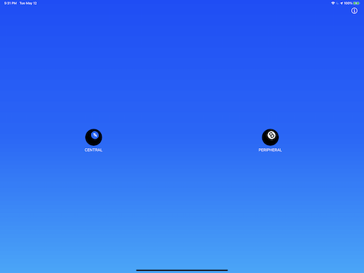
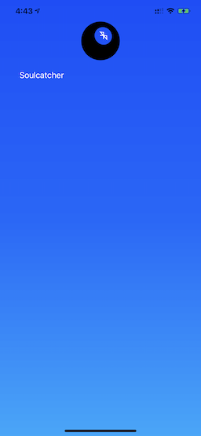
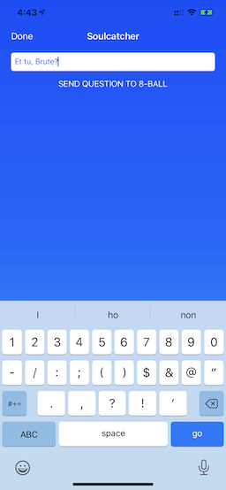
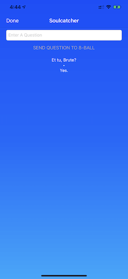
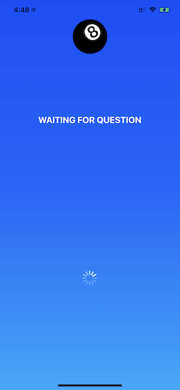
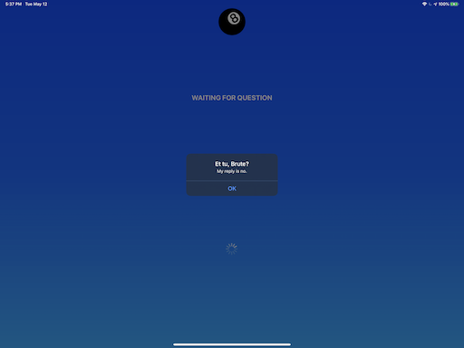
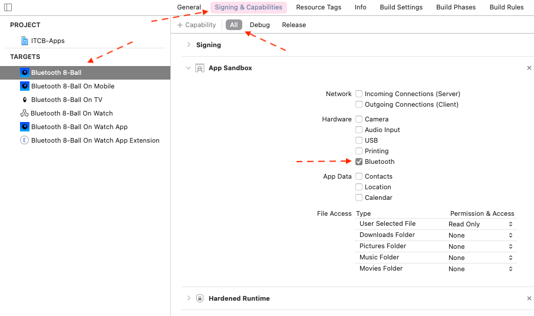

# CORE BLUETOOTH EXAMPLE PROJECT

This is a repo that will accompany a class on introduction to Core Bluetooth.

## STRUCTURE

The project consists of two parts: "Apps," that are complete, standalone applications (one for each Apple platform: [MacOS](https://apple.com/macos), [iOS](https://apple.com/ios)/[iPadOS](https://apple.com/ipados), [tvOS](https://apple.com/tvos), and [watchOS](https://apple.com/watchos)), and "SDKs," which are [Swift Frameworks](https://developer.apple.com/library/archive/documentation/MacOSX/Conceptual/BPFrameworks/Frameworks.html), embedded into each app. These frameworks implement the Core Bluetooth functionality, and are the target of the lesson, while the apps are merely high-functioning test harnesses.

### [The SDKs](https://github.com/ChrisMarshallNY/ITCB-master/tree/master/03-Final-CompleteImplementation/SDK-src)

The main focus of the lesson will be on the SDKs.

#### Common Core

The entirety of [the SDK code](https://github.com/ChrisMarshallNY/ITCB-master/tree/master/03-Final-CompleteImplementation/SDK-src/src) is shared between platforms, with the exception of [this file](https://github.com/ChrisMarshallNY/ITCB-master/blob/master/03-Final-CompleteImplementation/SDK-src/src/internal/Mac_iOS_Only/ITCB_SDK_Peripheral_internal.swift), which is only included in the [MacOS](https://github.com/ChrisMarshallNY/ITCB-master/tree/master/03-Final-CompleteImplementation/SDK-src/ITCB_SDK_Mac) and [iOS/iPadOS](https://github.com/ChrisMarshallNY/ITCB-master/tree/master/03-Final-CompleteImplementation/SDK-src/ITCB_SDK_iOS) targets (it implements Peripheral Mode, which is not supported in TV or Watch).

The various target directories ([MacOS](https://github.com/ChrisMarshallNY/ITCB-master/tree/master/03-Final-CompleteImplementation/SDK-src/ITCB_SDK_Mac), [iOS](https://github.com/ChrisMarshallNY/ITCB-master/tree/master/03-Final-CompleteImplementation/SDK-src/ITCB_SDK_iOS), [watchOS](https://github.com/ChrisMarshallNY/ITCB-master/tree/master/03-Final-CompleteImplementation/SDK-src/ITCB_SDK_Watch), and [tvOS](https://github.com/ChrisMarshallNY/ITCB-master/tree/master/03-Final-CompleteImplementation/SDK-src/ITCB_SDK_TVOS)) contain only a single [plist](https://www.google.com/url?sa=t&rct=j&q=&esrc=s&source=web&cd=13&cad=rja&uact=8&ved=2ahUKEwjytoaSy7HpAhXagnIEHdRwDRUQFjAMegQIPBAB&url=https%3A%2F%2Fdeveloper.apple.com%2Flibrary%2Farchive%2Fdocumentation%2FGeneral%2FReference%2FInfoPlistKeyReference%2FArticles%2FAboutInformationPropertyListFiles.html&usg=AOvVaw2rlth1YGdVn8U50mCDZp-n) file, each.

There is a separate target for each platform, with the naming convention of "ITCB_SDK_*`XXX`*", where "*`XXX`*" is replaced with the target operating system ("Mac", "iOS", "Watch", or "TV").

Each target is [a dynamic "pure Swift" framework](https://developer.apple.com/library/archive/documentation/DeveloperTools/Conceptual/DynamicLibraries/100-Articles/OverviewOfDynamicLibraries.html). By "pure Swift," we mean that there is no [bridging header](https://developer.apple.com/documentation/swift/imported_c_and_objective-c_apis/importing_swift_into_objective-c). Only Swift applications can use the SDK.

### [The Apps](https://github.com/ChrisMarshallNY/ITCB-master/tree/master/03-Final-CompleteImplementation/Apps-src)

The apps are "Ship-quality" apps, written to the standards of any apps destined to be sold/distributed through the various Apple App Stores. They are localizable and carefully designed.

They are not "super-advanced" apps, though. They don't use [SwiftUI](https://developer.apple.com/documentation/swiftui), for example; instead, sticking with the traditional [Interface Builder](https://developer.apple.com/xcode/interface-builder/).

They aren't the star of the show, and the lesson doesn't deal with them at all, except to mention the need for some plist values and a sandbox setting.

#### The Way They Work

The apps implement a rather simple "game," based on the famous [Mattel Magic 8-Ball Toy](https://en.wikipedia.org/wiki/Magic_8-Ball).

It requires two devices (at least), with one acting as a "Central" (the "question-asker"), and the other[s] acting as a "Peripheral" (the "question-answerers").

There will only be one Central, but there can be more than one Peripheral.

Only iOS/iPadOS and MacOS support Peripheral Mode, so those are the only app variants that can act as "question-answerers."

***NOTE:*** *The following example images are from the iOS app, on an iPad and an iPhone.*

#### The Initial Mode Selection Screen (iOS and MacOS apps Only)

*Figure 1: The Initial Mode Selection Screen*

In this screen, the user is presented with two image buttons: "CENTRAL", and "PERIPHERAL".

They each represent an operating mode for the app.

This screen is only shown at startup, and "commits" the user to that mode, thereafter. In order to change modes, the user needs to exit the application, and restart.

#### The Central Mode Screen

In Central Mode (which is also the only mode for tvOS and watchOS), the app acts as a "question-asking" app. The user is presented with a list of nearby Peripheral Mode devices in a simple, vertical table.

*Figure 2: The Central Mode Screen*

#### The Device Information Screen

Once a user selects one of the Peripherals, they are taken to a simple screen, with just a text entry field.

They use this field to "ask a question" of the Peripheral. It should be a "yes/no" question.

*Figure 3: Asking a Question*

The Peripheral will automatically return an answer, randomly selected from [the 20 standard answers](https://en.wikipedia.org/wiki/Magic_8-Ball#Possible_answers).

*Figure 4: Getting the Answer*

***NOTE:*** *In the Watch variant of the app, there is no room to enter a question, so one of 20 random questions is selected to be sent.*

#### The Peripheral Mode Screen

In Peripheral Mode *(Again, only for iOS/iPadOS and MacOS)*, the user doesn't do anything. The app reacts automatically to questions from the Central.

*Figure 5: Waiting for a Question*

Once a question is asked of a Peripheral, it is reported in an alert.

*Figure 6: Reporting an Answer*

***NOTE*** *The alert needs to be dismissed by the user, so there is "a bit" of user interaction in Peripheral Mode.*

## APP PROVISIONING REQUIREMENTS

### PLIST STRINGS (ALL PLATFORMS)

In order to run the apps, using Core Bluetooth, it is necessary to add some fields to the app `info.plist` file. The App Store will not allow release of apps that don't have these rows:

- [`NSBluetoothPeripheralUsageDescription`](https://developer.apple.com/documentation/bundleresources/information_property_list/nsbluetoothperipheralusagedescription) *(Deprecated)*
- [`NSBluetoothAlwaysUsageDescription`](https://developer.apple.com/documentation/bundleresources/information_property_list/nsbluetoothalwaysusagedescription) *(Current)*

I usually add both, even though `NSBluetoothPeripheralUsageDescription` is no longer necessary.

If you do not include at least `NSBluetoothAlwaysUsageDescription`, your app will experience a runtime crash, as soon as a Core Bluetooth call is made. If you are not running the debugger, it can be difficult to figure out why this happened. The debugger gives a very clear console message; explaining the issue.

### APP SANDBOX SETTING (MACOS)

For MacOS, there is an additional step that needs to be taken, if you wish to use the [App Sandbox](https://developer.apple.com/library/archive/documentation/Security/Conceptual/AppSandboxDesignGuide/AboutAppSandbox/AboutAppSandbox.html):

*Figure 7: The Sandbox Checkbox*

In order to set this, you need to select the MacOS target, then, in the top tab bar, select "Signing & Capabilities," select "All" (or at least "Release"), then, scroll to the "App Sandbox" section, and select "Bluetooth," in the "Hardware" section.

If this is not checked, you won't get a crash, but the Bluetooth subsystem just plain won't work.
